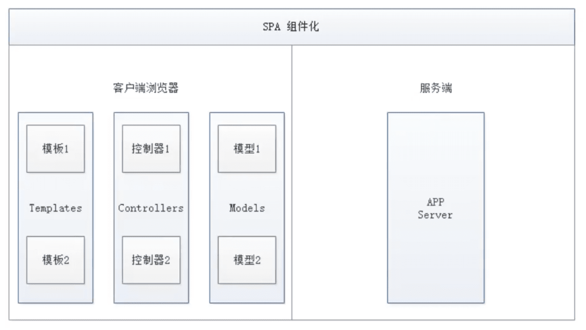

# Vue上手教程


🔖p1 回顾SSM

https://www.bilibili.com/video/BV18E411a7mC

## 1 前端综述

### 逻辑

- 判断
- 循环


### 事件

- 浏览器事件：window  document
- DOM事件：增删、遍历、修改节点元素内容

jQuery等


### 视图

- html
- css（难点）

### 通信

- xhr
- ajax
- axios


前端化工程：SSM + Vue 


## 2 前端体系、前后端分离

### 1、概述

HTML + CSS + JS


网络通信： axios

页面跳转：vue-router

状态管理：vuex

Vue-UI：


Vue：构建用户界面的**渐进式框架**。

Vue的核心库只关注视图层


### 2、前端知识体系

#### 前端三要素

##### HTML（结构）

##### CSS（表现）

##### **CSS预处理器**

CSS预处理器，提供CSS缺失的样式层复用机制、減少冗余代码，提高样式代码的可维护性。大大提高了前端在样式上的开发效率。

CSS预处理器定义了一种新的语言，其基本思想是，用一种专门的编程语言，为 CSS 增加了编程的特性，将 CSS 作为目标生成文件，然后开发者就只要使用这种语言进行 CSS的编码工作。

转化成通俗易懂的话来说就是**”用一种专门的编程语言，进行 Web页面样式设计，再通过编译器转化为正常的CSS文件，以供项目使用“**。

常用的 CSS 预处理器有哪些

- SASS：基于 Ruby，通过服务端处理，功能强大。解析效率高。需要学习 Ruby 语言，上手难度高于LESS。
- LESS：基于 NodeJs，通过客户端处理，使用简单。功能比 SASS简单，解析效率也低于SASS， 但在实际开发中足够了，所以我们后台人员如果需要的话，建议使用LESS。

##### JavaScript（行为）

###### 原生JS开发

原生JS：**ECMAScript**，特点是所有浏览器都支持。

前端打包工具：webpack

###### TypeScript 微软的标准

TypeScript是一种由微软开发的自由和开源的编程语言。它是JavaScript的一个超集，而且本质上向这个语言添加了==可选的静态类型和基于类的面向对象==编程。由安德斯.海尔斯伯格（C#、Delphi、 TypeScript之父；.NET创立者）主导。

该语言的特点就是除了具备ES的特性之外还纳入了许多**不在标准范围内的新特性**，所以会导致很多浏览器不能直接支持TypeScript语法，**需要编译后（编译成JS）**才能被浏览器正确执行。


#### JavaScript框架

- jQuery；大家熟知的JavaScript框架，优点是简化了DOM操作，缺点是DOM操作太频繁，影响前端性能；在前端眼里使用它仅仅是为了兼容1E6、7、8；

- Angular：Google收购的前端框架，由一群Java程序员开发，其特点是将后台的MVC模式搬到了前端并增加了**模块化开发**的理念，与微软合作，采用TypeScript语法开发；对后台程序员友好，对前端程序员不太友好；

  最大的缺点是版本迭代不合理（如：1代 -> 2代，除了名字，基本就是两个东西；截止发表博客时已推出了Angular6）

- React：Facebook出品，一款高性能的JS前端框架；特点是提出了新概念【**虚拟DOM**】用于减少真实DOM操作，在内存中模拟DOM操作，有效的提升了前端渲染效率；

  缺点是使用复杂，因为需要额外学习一门【JSX】语言；

- Vue：一款渐进式JavaScript框架，所谓渐进式就是**逐步实现新特性**的意思，如实现模块化开发、路由、状态管理等新特性。其特点是**综合了Angular（模块化）和React（虚拟DOM）**的优点；

- Axios：前端**通信框架**；因为Vue的边界很明确，就是为了处理DOM，所以并不具备通信能力，此时就需要额外使用一个通信框架与服务器交互；当然也可以直接选择使用jQuery提供的AJAX通信功能；

#### UI框架

- [Ant-Design](https://ant.design/index-cn)：阿里巴巴，基于React
- ElementUI、iview、ice：饿了么，基于Vue
- Bootstrap
- AmazeUI

#### JavaScript构建工具

- Babel：JS编译工具，主要用于浏览器不支持的ES新特性，比如用于编译TypeScript
- WebPack：模块打包器，主要作用是打包、压缩、合并及按序加载

#### 三端统一

##### 混合开发（Hybrid App）

主要目的是实现一套代码三端统一（PC、Android：.apk、ios：.ipa）并能够调用到设备底层硬件（如：传感器、GPS、摄像头等），打包方式主要有以下两种：

- 云打包：HBuild-》HBuildX，DCloud出品；API Cloud
- 本地打包：Cordova（前身是PhoneGap）

##### 微信小程序

详见微信官网，这里就是介绍一个方便微信小程序UI开发的框架：WeUI

#### 后端技术

前端人员为了方便开发也需要掌握一定的后端技术，但我们Java后台人员知道后台知识体系极其庞大复杂，所以为了方便前端人员开发后台应用，就出现了NodeJS这样的技术。

NodeJS的作者已经声称放弃NodeJS（说是架构做的不好再加上笨重的node_modules，可能让作者不爽了吧），开始开发全新架构的**Deno**。

既然是后台技术，那肯定也需要框架和项目管理工具，NodeJS框架及项目管理工具如下：

- Express： NodeJS框架
- Koa：Express简化版
- NPM：项目综合管理工具，类似于Maven
- YARN：NPM的替代方案，类似于Maven和Gradle的关系


#### 主流前端框架

Vue.js

##### iView 以不更新

移动端

https://github.com/iview/iview

##### ElementUI

主要桌面端。

vue-element-admin

https://panjiachen.github.io/vue-element-admin-site/zh/

##### ICE

飞冰是阿里巴巴团队基于React/Angular/Vue的中后台应用解决方案， 在阿里巴巴内部， 已经有270多个来自几乎所有BU的项目在使用。飞冰包含了一条从设计端到开发端的完整链路，帮助用户快速搭建属于自己的中后台应用。

https://v3.ice.work/

##### VantUI

有赞

https://vant-contrib.gitee.io/vant/#/zh-CN

##### AtUI

##### CueUI


混合开发

##### Flutter

Ionic


微信小程序

##### mpvue 

mpvue是美团开发的一个使用`Vue.js`开发小程序的前端框架， 目前支持微信小程序、百度智能小程序，头条小程序和支付宝小程序。

##### WeUI


### 3、前后分离的演变史

#### 3.1 后端为主的MVC时代

SpringMVC流程：


- 发起请求到前端控制器(`DispatcherServlet`)
- 前端控制器请求`HandlerMapping`查找`Handler`，可以根据`xml`配置、注解进行查找
- 处理器映射器`HandlerMapping`向前端控制器返回`Handler`
- 前端控制器调用处理器适配器去执行`Handler`
- 处理器适配器去执行`Handler`
- `Handler`执行完成给适配器返回`ModelAndView`
- 处理器适配器向前端控制器返回`ModelAndView`，`ModelAndView`是`SpringMvc`框架的一个底层对象，包括`Model`和`View`
- 前端控制器请求视图解析器去进行视图解析，根据逻辑视图名解析成真正的视图(`JSP`)
- 视图解析器向前端控制器返回`View`
- 前端控制器进行视图渲染，视图渲染将模型数据(在`ModelAndView`对象中)填充到`request`域
- 前端控制器向用户响应结果

优点：

MVC是一个非常好的协作模式，能够有效降低代码的耦合度，从架构上能够让开发者明白代码应该写在哪里。为了让 View 更纯粹，还可以使用 Thymeleaf、Freemarker 等模板引擎，使模板里无需写入Java代码，让前后端分工更加清晰。

缺点：

- 前端开发重度依赖开发环境，开发效率低，这种架构下，前后端协作有两种模式：
  - 第一种是前端写DEMO， 写好后， 让后端去套模板。好处是DEMO可以本地开发， 很高效。不足是还需要后端套模板，有可能套错，套完后还需要前端确定，来回沟通调整的成本比较大；
  - 另一种协作模式是前端负责浏览器端的所有开发和服务器端的View层模板开发。好处是UI相关的代码都是前端去写就好，后端不用太关注，不足就是前端开发重度绑定后端环境，环境成为影响前端开发效率的重要因素。
- 前后端职责纠缠不清：模板引擎功能强大，依旧可以通过拿到的上下文变量来实现各种业务逻辑。这样，只要前端弱势一点，往往就会被后端要求在模板层写出不少业务代码，还有一个很大的灰色地带是Controller， 页面路由等功能本应该是前端最关注的， 但却是由后端来实现。Controller本身与Model往往也会纠缠不清，看了让人咬牙的业务代码经常会出现在Controller层。这些问题不能全归结于程序员的素养， 否则JSP就够了。
- 对前端发挥的局限性：性能优化如果只在前端做空间非常有限，于是我们经常需要后端合作，但由于后端框架限制，我们很难使【**Comet**】、【**BigPipe**】等技术方案来优化性能。


#### 3.2 基于AJAX带来的SPA时代

时间回到2005年AOAX(Asynchronous JavaScript And XML， 异步JavaScript和XML，老技术新用法)被正式提出并开始使用CDN作为静态资源存储， 于是出现了JavaScript王者归来(在这之前JS都是用来在网页上贴狗皮膏药广告的) 的SPA(Single Page Application) 单页面应用时代。


**优点**

这种模式下， **前后端的分工非常清晰， 前后端的关键协作点是AJAX接口。**看起来是如此美妙， 但回过头来看看的话， 这与JSP时代区别不大。复杂度从服务端的JSP里移到了浏览器的JavaScript，浏览器端变得很复杂。类似Spring MVC， **这个时代开始出现浏览器端的分层架构**：


缺点

- **前后端接口的约定**：如果后端的接口一塌糊涂，如果后端的业务模型不够稳定，那么前端开发会很痛苦；不少团队也有类似尝试，通过接口规则、接口平台等方式来做。**有了和后端一起沉淀的接口规则，还可以用来模拟数据，使得前后端可以在约定接口后实现高效并行开发。**
- 前端开发的复杂度控制：SPA应用大多以功能交互型为主，JavaScript代码过十万行很正常。大量JS代码的组织，与View层的绑定等，都不是容易的事情。

#### 3.3 前端为主的MV*时代

- MVC(同步通信为主) ：Model、View、Controller
- MVP(异步通信为主) ：Model、View、Presenter
- MVVM(异步通信为主)：Model、View、View Model为了降低前端开发复杂度，涌现了大量的前端框架，比如：`Angular JS`、`React`、`Vue.js`、`Ember JS`等， 这些框架总的原则是先按类型分层， 比如Templates、Controllers、Models， 然后再在层内做切分，如下图：



**优点**

- **前后端职责很清晰**：前端工作在浏览器端，后端工作在服务端。清晰的分工，可以让开发并行，测试数据的模拟不难， 前端可以本地开发。后端则可以专注于业务逻辑的处理， 输出RESTful等接口。

- **前端开发的复杂度可控**：前端代码很重，但合理的分层，让前端代码能各司其职。这一块蛮有意思的，简单如模板特性的选择，就有很多很多讲究。并非越强大越好，限制什么，留下哪些自由，代码应该如何组织，所有这一切设计，得花一本书的厚度去说明。

- **部署相对独立**：可以快速改进产品体验

  

缺点

- 代码不能复用。比如后端依旧需要对数据做各种校验，校验逻辑无法复用浏览器端的代码。如果可以复用，那么后端的数据校验可以相对简单化。
- 全异步， 对SEO不利。往往还需要服务端做同步渲染的降级方案。
- 性能并非最佳，特别是移动互联网环境下。
- SPA不能满足所有需求， 依旧存在大量多页面应用。URL Design需要后端配合， 前端无法完全掌控。

#### 3.4 NodeJS带来的全栈时代

前端为主的MV*模式解决了很多很多问题， 但如上所述， 依旧存在不少不足之处。随着Node JS的兴起， JavaScript开始有能力运行在服务端。这意味着可以有一种新的研发模式：


在这种研发模式下，前后端的职责很清晰。对前端来说，两个UI层各司其职：

- Front-end Ul layer处理浏览器层的展现逻辑。通过CSS渲染样式， 通过JavaScript添加交互功能， HTML的生成也可以放在这层， 具体看应用场景。
- Back-end Ul layer处理路由、模板、数据获取、Cookie等。通过路由， 前端终于可以自主把控URL Design， 这样无论是单页面应用还是多页面应用， 前端都可以自由调控。后端也终于可以摆脱对展现的强关注，转而可以专心于业务逻辑层的开发。
  通过Node， WebServer层也是JavaScript代码， 这意味着部分代码可前后复用， 需要SEO的场景可以在服务端同步渲染，由于异步请求太多导致的性能问题也可以通过服务端来缓解。前一种模式的不足，通过这种模式几乎都能完美解决掉。
  与JSP模式相比， 全栈模式看起来是一种回归， 也的确是一种向原始开发模式的回归， 不过是一种螺旋上升式的回归。
  基于Node JS的全栈模式， 依旧面临很多挑战：
- 需要前端对服务端编程有更进一步的认识。比如TCP/IP等网络知识的掌握。
- Node JS层与Java层的高效通信。Node JS模式下， 都在服务器端， RESTful HTTP通信未必高效， 通过SOAP等方式通信更高效。一切需要在验证中前行。
- 对部著、运维层面的熟练了解，需要更多知识点和实操经验。
- 大量历史遗留问题如何过渡。这可能是最大最大的阻力。
  **注：看到这里，相信很多同学就可以理解，为什么我总在课堂上说：“前端想学后台很难，而我们后端程序员学任何东西都很简单”；就是因为我们后端程序员具备相对完善的知识体系。**
  全栈!So Easy!

#### 3.5、总结

综上所述，模式也好，技术也罢，没有好坏优劣之分，只有适合不适合；前后分离的开发思想主要是基于`Soc`(关注度分离原则)，上面种种模式，都是让前后端的职责更清晰，分工更合理高效。

## 3 MVVM和Vue的第一个程序

### 什么是MVVM

MVVM（Model-View-ViewModel）是一种软件架构设计模式，由微软WPF（用于替代WinForm，以前就是用这个技术开发桌面应用程序的）和Silverlight（类似于Java Applet，简单点说就是在浏览器上运行的WPF）的架构师KenCooper和Ted Peters开发，是一种简化用户界面的**事件驱动编程方式**。由John Gossman（同样也是WPF和Silverlight的架构师）于2005年在他的博客上发表。

MVVM源自于经典的MVC（Model-View-Controller）模式。MVVM的核心是**ViewModel层**，负责转换Model中的数据对象来让数据变得更容易管理和使用，其作用如下：

- 该层向上与视图层进行**双向数据绑定**
- 向下与Model层通过接口请求进行数据交互


MVVM已经相当成熟了，主要运用但不仅仅在网络应用程序开发中。当下流行的MVVM框架有`Vue.js`， `AngularJS`等。

### 为什么要使用MVVM

MVVM模式和MVC模式一样，主要目的是分离视图（View）和模型（Model），有几大好处：

- 低耦合：视图（View）可以独立于Model变化和修改，一个ViewModel可以绑定到不同的 View上，当View变化的时候Model可以不变，当Model变化的时候View也可以不变。
- 可复用：你可以把一些视图逻辑放在一个ViewModel里面，让很多View重用这段视图逻辑。
- 独立开发开发人员可以专注于业务逻辑和数据的开发（ViewModel），设计人员可以专注于页面设计。
- 可测试：界面素来是比较难于测试的，而现在测试可以针对ViewModel来写。


#### View

View是视图层， 也就是用户界面。前端主要由HTH L和csS来构建， 为了更方便地展现vi eu to del或者Hodel层的数据， 已经产生了各种各样的前后端模板语言， 比如FreeMarker，Thyme leaf等等， 各大MVVM框架如Vue.js、Angular JS等也都有自己用来构建用户界面的内置模板语言。

#### Model

Model是指数据模型， 泛指后端进行的各种业务逻辑处理和数据操控， 主要围绕数据库系统展开。这里的难点主要在于需要和前端约定统一的接口规则

#### ViewModel

ViewModel是由前端开发人员组织生成和维护的视图数据层。在这一层， 前端开发者对从后端获取的Model数据进行转换处理， 做二次封装， 以生成符合View层使用预期的视图数据模型。

需要注意的是ViewModel所封装出来的数据模型包括**视图的状态和行为**两部分， 而Model层的数据模型是只包含状态的

- 比如页面的这一块展示什么，那一块展示什么这些都属于视图状态(展示)
- 页面加载进来时发生什么，点击这一块发生什么，这一块滚动时发生什么这些都属于视图行为(交互)

视图状态和行为都封装在了View Model里。这样的封装使得View Model可以完整地去描述View层。由于实现了双向绑定， View Model的内容会实时展现在View层， 这是激动人心的， 因为前端开发者再也不必低效又麻烦地通过操纵DOM去更新视图。
MVVM框架已经把最脏最累的一块做好了， 我们开发者只需要处理和维护View Model， 更新数据视图就会自动得到相应更新，真正实现`事件驱动编程`。

View层展现的不是`Model`层的数据， 而是`ViewModel`的数据， 由`ViewModel`负责与`Model`层交互， 这就**完全解耦了View层和Model层， 这个解耦是至关重要的， 它是前后端分离方案实施的重要一环。**


### Vue

Vue(读音/vju/， 类似于view) 是一套用于构建用户界面的渐进式框架， 发布于2014年2月。与其它大型框架不同的是， Vue被设计为可以自底向上逐层应用。Vue的核心库只关注视图层， 不仅易于上手， 还便于与第三方库(如：vue-router，vue-resource，vue x) 或既有项目整合。

#### MVVM模式的实现者

- Model：模型层， 在这里表示JavaScript对象
- View：视图层， 在这里表示DOM(HTML操作的元素)
- ViewModel：连接视图和数据的中间件， Vue.js就是MVVM中的ViewModel层的实现者

在MVVM架构中， 是不允许数据和视图直接通信的， 只能通过ViewModel来通信， 而View Model就是定义了一个Observer观察者

- ViewModel能够观察到数据的变化， 并对视图对应的内容进行更新
- ViewModel能够监听到视图的变化， 并能够通知数据发生改变

至此， 我们就明白了， Vue.js就是一个MV VM的实现者， 他的核心就是实现**了DOM监听与数据绑定**。

#### 为什么要使用Vue.js

- 轻量级， 体积小是一个重要指标。Vue.js压缩后有只有20多kb(Angular压缩后56kb+，React压缩后44kb+)
- 移动优先。更适合移动端， 比如移动端的Touch事件
- 易上手，学习曲线平稳，文档齐全
- 吸取了Angular(模块化) 和React(虚拟DOＭ) 的长处， 并拥有自己独特的功能，如：计算属性
- 开源，社区活跃度高

### Vue属性

必须知道vue的7个属性，8个方法，以及7个指令。**787原则**


#### el属性

用来指示vue编译器从什么地方开始解析vue的语法，可以说是一个占位符。

#### data属性

用来组织从view中抽象出来的属性，可以说将视图的数据抽象出来存放在data中。

#### template属性

用来设置模板，会替换页面元素，包括占位符。

#### methods属性

放置页面中的业务逻辑，js方法一般都放置在methods中

#### render属性

创建真正的虚拟DOM

#### computed属性

用来计算

- 计算属性：
  + 要表示的数据不存在，要通过计算得来。
  + 在 computed 对象中定义计算属性
  + 在页面中使用{{方法名}}来显示计算的结果
  + 要用的属性不存在，要通过已有的属性计算得来。它是一个能够将计算结果缓存起来的属性，可以想象为缓存。
- 底层借助了 Object.defineproperty 方法提供的 getter 和 setter 方法。
- 优势：与 methods 实现相比，内部具有缓存机制（复用），效率更高，调试更方便
- 注意：
  + 计算属性最终会出现在 Vue实例上，直接读取使用即可。
  + 如果计算属性要被修改，那必须写 set 函数去相应修改，

#### watch属性

- 监听 Vue 实例中 data 属性中数据的变化
- 通过 vm 对象的 $watch() 或 watch 配置来监视指定的属性
- 当属性变化时，回调函数自动调用，在函数内部进行计算
- eg. watch:function(new, old){}
- 两个参数：一个用于返回新值，一个用于返回旧值。


### Vue指令

#### v-bind

绑定解析表达式

```html
<!DOCTYPE html>
<html lang="en" xmlns:v-bind="http://www.w3.org/1999/xhtml">
<head>
    <meta charset="UTF-8">
    <title>Title</title>

</head>
<body>

<!--view层，模板-->
<div id="app">
    <span v-bind:title="message">
    鼠标悬停几秒钟查看此处动态绑定的提示信息！
  </span>
</div>

<!--1.导入Vue.js-->
<script src="https://cdn.jsdelivr.net/npm/vue@2.5.21/dist/vue.min.js"></script>
<script type="text/javascript">
    var vm = new Vue({
        el:"#app",
        /*Model：数据*/
        data:{
            message: '页面加载于 ' + new Date().toLocaleString()
        }
    });
</script>
</body>
</html>
```

`v-xxxx`都称为**指令**。指令带有前缀v以表示它们是Vue提供的特殊特性。 它们会在渲染的DOM上应用特殊的响应式行为在这里。`v-bind:title="message"`该指令的意思是：“将这个元素节点的title特性和Vue实例的message属性保持一致”。

如果你再次打开浏览器的JavaScript控制台， 输入`vm.message='新消息'`，就会再一次看到这个绑定了title特性的HTML已经进行了更新。


#### v-if， v-else

v-if：如果为 true，当前标签才会输出到页面

v-else：如果为 false，当前标签才会输出到页面

```html
<!DOCTYPE html>
<html lang="en" xmlns:v-bind="http://www.w3.org/1999/xhtml">
<head>
    <meta charset="UTF-8">
    <title>Title</title>
</head>
<body>
<!--view层，模板-->
<div id="app">
    <h1 v-if="ok">Yes</h1>
    <h1 v-else>No</h1>
   
</div>

<!--1.导入Vue.js-->
<script src="https://cdn.jsdelivr.net/npm/vue@2.5.21/dist/vue.min.js"></script>
<script type="text/javascript">
    var vm = new Vue({
        el:"#app",
        /*Model：数据*/
        data:{
            type: true
        }
    });
</script>
</body>
</html>
```

#### v-else-if

```html
<div id="app">
    <h1 v-if="type==='A'">A</h1>
    <h1 v-else-if="type==='B'">B</h1>
    <h1 v-else-if="type==='D'">D</h1>
    <h1 v-else>C</h1>
</div>
```

#### v-for

```html
<div id="app">
    <li v-for="(item,index) in items">
        {{item.message}}---{{index}}
    </li>
</div>

<script type="text/javascript">
    var vm = new Vue({
        el:"#app",
        data:{
            items:[
                {message:'Java'},
                {message:'PHP'},
                {message:'GO'}
            ]
        }
    });
</script>
```


#### v-on

绑定监听事件，可以简写: eg. v-on:click=“” 简写为@click=“”

```html
<div id="app">
    <button v-on:click="sayHi">点我</button>
</div>


<script type="text/javascript">
    var vm = new Vue({
        el:"#app",
        data:{
            message:'Hello World'
        },
        methods:{
            sayHi:function(event){
                //'this'在方法里面指向当前Vue实例
                alert(this.message);
            }
        }
    });
</script>
```

#### v-model

双向数据绑定

#### v-text

更新元素的textContent

#### v-html

更新元素的innerHTML

#### v-show

通过 display 样式来控制显示/隐藏

#### v-cloak 


### Vue的8种方法

生命周期的八个钩子函数，可以在vue的各个阶段添加代码。

- beforeCreate() 创建实例
- created() 创建完成
- beforeMount() 创建模板
- mounted() 创建完成
- beforeUpdate() 更新状态
- updated() 更新完成
- beforeDestory() 销毁 vue 实例
- destoryed() 销毁完成


## 4 表单双绑、组件

### 什么是双向数据绑定？

Vue.js是一个MVVM框架，即数据双向绑定，当数据发生变化的时候，视图也发生变化，当视图发生变化的时候，数据也会跟着同步变化。这是Vue.js的**精髓**之处了。

> 注意：==数据双向绑定==，一定是对于UI控件来说的，非UI控件不会涉及到数据双向绑定。


### 在表单中使用双向数据绑定

`v-model` 在表单`<input>`、`<textarea>`、`<select>`上创建双向数据绑定。它负责监听用户的输入事件和更新数据，并对一些极端场景进行一些特殊处理。

> 注意：`v-model`会忽略所有表单元素的value、checked、selected特性的初始值而总是将Vue实例的数据作为数据来源。应该通过JS咋组件data选项中声明初始值！


```html
<div id="app">
    下拉框：
    <select v-model="selected">
        <option disabled value="">--请选择--</option>
        <option>A</option>
        <option>B</option>
        <option>C</option>
        <option>D</option>
    </select>
    <span>选中的值：{{selected}}</span>
</div>


<script src="https://unpkg.com/vue/dist/vue.js"></script>
<script>

    var vm = new Vue({
        el: '#app',
        data: {
            selected: ''
        }
    });

</script>
```

> 注意：如果 v-mode1 表达式的初始值末能匹配任何选项，<select＞元索将被渲染为“未选中状志。在iOS 中，这会便用户无法选择第一个选项。因为这样的情况下，iOS不会触发change事件。因此，更推荐像上面这样提供一个值为空的禁用选项。


### Vue组件

组件是可复用的`Vue`实例，说白了就是一组可重复使用的模板，跟JSTL的自定义标签、Thymeleaf的`th:fragment`等框架有着异曲同工之妙。通常一个应用会以一棵嵌套的祖建树的形式来组织：


```html
<!DOCTYPE html>
<html lang="en">
<head>
    <meta charset="UTF-8">
    <title>Title</title>
</head>
<body>

<div id="app">
    <rongming></rongming>
</div>

<script src="https://unpkg.com/vue/dist/vue.js"></script>
<script>

    Vue.component('rongming', {
        template: '<li>hello</li>'
    })

    var vm = new Vue({
        el: '#app',
    });

</script>
</body>
</html>
```

```html
<!DOCTYPE html>
<html lang="en">
<head>
    <meta charset="UTF-8">
    <title>Title</title>
</head>
<body>

<div id="app">
	<!-- 组件：传递给组件中的值：props -->
    <rongming v-for="item in items" v-bind:key1="item"></rongming>
</div>

<script src="https://unpkg.com/vue/dist/vue.js"></script>
<script>

    Vue.component('rongming', {
		props: ['key1'],
        template: '<li>{{key1}}</li>'
    });
    

    var vm = new Vue({
        el: '#app', 
		data: {
			items: ["Java", "Linux", "iOS"]
		}
    });

</script>
</body>
</html>
```


## 5 Axios异步通信

Axios是一个开源的可以用在浏览器端和NodeJS 的异步通信框架，它的主要作用就是实现AJAX异步通信，其功能特点如下:

- 从浏览器中创建XMLHttpRequests

- 从node.js创建http请求

- 支持Promise API [JS中链式编程]，使用Promise管理异步，告别传统callback方式

- 拦截请求和响应

- 转换请求数据和响应数据

- 取消请求

- 自动转换JSON数据

- 客户端支持防御XSRF (跨站请求伪造)

  

GitHub: https://github.com/axios/axios
中文文档: http://www.axios-js.com/


### 为什么要使用Axios

由于Vue.js是一个视图层框架作者(尤雨溪) 严格准守SoC (关注度分离原则)，所以Vue.js并不包含AJAX的通信功能，为了解决通信问题，作者单独开发了一个名为vue-resource的插件，不过在进入2.0 版本以后停止了对该插件的维护并推荐了Axios 框架。**少用jQuery，因为它操作Dom太频繁**!


```html
<!DOCTYPE html>
<html lang="en" xmlns:v-bind="http://www.w3.org/1999/xhtml">
<head>
    <meta charset="UTF-8">
    <title>Title</title>
    <!-- v-cloak：解决闪烁问题，就是数据加载完不要显示   -->
    <style>
        [v-cloak]{
            display: none;
        }
    </style>
</head>
<body>

<div id="app" v-cloak>
    <div>{{info.name}}</div>
    <div>{{info.address.street}}</div>
    <div>{{info.address.city}}</div>
    <a v-bind:href="info.url">点我</a>
</div>

<script src="https://unpkg.com/vue/dist/vue.js"></script>
<script sr c="https://unpkg.com/axios/dist/axios.min.js"></script>
<script>
    var vm = new Vue({
        el: '#app', 
		mounted() { // 钩子函数 ES6新特性
			axios.get('./data.json').then(response=>(this.info=response.data));
		},
        // data方法，注意区别于data属性
        data() {
            return {
                // 字段必须和json字符串相同，可以少些，但不要写错
                info: {
                    name: null,
                    address: {
                        street: null,
                        city: null,
                        country: null,
                    },
                    url: null
                }
            }
        }
    });

</script>
</body>
</html>
```


### Vue的生命周期


## 6 计算属性、内容分发、自定义事件

### 计算属性

计算属性的重点突出在**属性**两个字上(属性是名词)，首先它是个属性，其次这个属性有**计算**的能力(计算是动词)，这里的计算就是个函数;简单点说，它就是一个能够==将计算结果缓存起来的属性==(将行为转化成了静态的属性)，仅此而已;可以想象为**缓存**!

```html
<!DOCTYPE html>
<html lang="en">
<head>
    <meta charset="UTF-8">
    <title>Title</title>
</head>
<body>

<div id="app">
    <p>currentTime1: {{currentTime1()}}</p>
    <p>currentTime2: {{currentTime2}}</p>
</div>

<script src="https://unpkg.com/vue/dist/vue.js"></script>
<script src="https://unpkg.com/axios/dist/axios.min.js"></script>
<script>
    var vm = new Vue({
        el: '#app',
        data: {
            message: 'hello, world!',
        },
        methods: {
            currentTime1: function () {
                return Date.now();
            }
        },
        computed: {
            currentTime2: function () {  // 计算属性类似缓存，如果方法中没有变化，它就不会重新运行了
                this.message;
                return Date.now();
            }
        }
    });
</script>
</body>
</html>
```

说明：

- methods：定义方法， 调用方法使用currentTime1()， 需要带括号
- computed：定义计算属性， 调用属性使用currentTime2， 不需要带括号：this.message是为了能够让currentTime2观察到数据变化而变化

**结论：**
  调用方法时，每次都需要讲行计算，既然有计算过程则必定产生系统开销，那如果这个结果是不经常变化的呢?此时就可以考虑将这个结果缓存起来，采用计算属性可以很方便的做到这点，**计算属性的主要特性就是为了将不经常变化的计算结果进行缓存，以节约我们的系统开销；**


### 内容分发🔖

插槽 `<slot>`


自定义事件内容分发

🔖p12


## 7 第一个Vue-cli项目

vue-cli是官方提供的一个脚手架，用于快速生成一个Vue项目模板。

预先定义好的目录结构及基础代码，就好比创建爱你Maven项目时可以现在创建一个骨架项目，这个骨架项目就是脚手架，让我们开发更加的快速。

主要功能：

- 统一的目录结构
- 本地调式
- 热部署
- 单元测试
- 集成打包上线

### 需要的环境

- Nodejs

- Git

Mac 安装Nodejs默认地址

```bash
/usr/local/bin/node
/usr/local/bin/npm
```

`npm ... -g` 安装的包位置：

```
/usr/local/lib/node_modules
```

#### 安装nodejs淘宝镜像加速器（cnpm）

```bash
# -g 全局
sudo npm install cnpm -g

```

查看包安装位置：

```bash
$ npm root -g
/usr/local/lib/node_modules
```

#### 安装vue-cli

```bash
sudo cnpm install vue-cli -g
```

成功：

```bash
[vue-cli@2.9.6] link /usr/local/bin/vue@ -> /usr/local/lib/node_modules/vue-cli/bin/vue
[vue-cli@2.9.6] link /usr/local/bin/vue-init@ -> /usr/local/lib/node_modules/vue-cli/bin/vue-init
[vue-cli@2.9.6] link /usr/local/bin/vue-list@ -> /usr/local/lib/node_modules/vue-cli/bin/vue-list
```


```bash
# 查看可以基于那些模板创建vue，通常选择webpack
$ vue list

  Available official templates:

  ★  browserify - A full-featured Browserify + vueify setup with hot-reload, linting & unit testing.
  ★  browserify-simple - A simple Browserify + vueify setup for quick prototyping.
  ★  pwa - PWA template for vue-cli based on the webpack template
  ★  simple - The simplest possible Vue setup in a single HTML file
  ★  webpack - A full-featured Webpack + vue-loader setup with hot reload, linting, testing & css extraction.
  ★  webpack-simple - A simple Webpack + vue-loader setup for quick prototyping.
```


> ```bash
> # 升级npm
> npm install -g npm
> ```
>
> 


### 创建第一个vue-cli程序

```bash
sudo vue init webpack myvue
```


#### 初始化并运行

```bash
cd myvue
sudo npm install  # 根据项目依赖文件package.json，在项目中安装相关依赖文件
sudo npm audit fix # 可能需要的修复
# 最终在项目中生成一个100多M、两万多个文件的node_modules目录


sudo npm run dev  # 启动当前项目
```

```
 DONE  Compiled successfully in 3400ms                                                                                             下午10:16:47

 I  Your application is running here: http://localhost:8080
```

```bash
# 更改项目目录及其所有子目录和文件的所有者
sudo chown -R andyron myvue
```


## 8 Webpack

本质上，webpack是一个现代JavaScript应用程序的**静态模块打包器**（module bundler）。当webpack处理应用程序时，它会递归地构建一个依赖关系图（dependency graph），其中包含应用程序需要的每个模块，然后将所有这些模块打包成一个或多个bundle.

Webpack是当下最热门的前端资源模块化管理和打包工具，它可以将许多松散耦合的模块按照依赖和规则打包成符合生产环境部署的前端资源。还可以将按需加载的模块进行代码分离，等到实际需要时再**异步加载**。通过loader转换，任何形式的资源都可以当做模块，比如CommonsJS、
AMD、ES6、cSS、JSON、CoffeeScript、LESS等；

伴随着移动互联网的大潮，当今越来越多的网站已经从网页模式进化到了WebApp模式。它们运行在现代浏览器里，使用HTML5、CSS3、ES6等新的技术来开发丰富的功能，网页已经不仅仅是完成浏览器的基本需求；WebApp通常是一个SPA（单页面应用），每一个视图通过异步的方式加载，这导致页面初始化和使用过程中会加载越来越多的JS代码，这给前端的开发流程和资源组织带来了巨大挑战。

前端开发和其他开发工作的主要区别，首先是前端基于多语言、多层次的编码和组织工作，其次前端产品的交付是基于浏览器的，这些资源是通过增量加载的方式运行到浏览器端，如何在开发环境组织好这些碎片化的代码和资源，并且保证他们在浏览器端快速、优雅的加载和更新，就需要一个模块化系统，这个理想中的模块化系统是前端工程师多年来一直探索的难题。

### 模块化的演进

#### Script标签

```html
<script src="module1.js"></script>
<script src="module2.js"></script>
<script src="module3.js"></script>
<script src="module4.js"></script>
```

这是最原始的JavaScript文件加载方式，如果把每一个文件看做是一个模块，那么他们的接口通常是暴露在全局作用域下，也就是定义在window对象中，不同模块的调用都是一个作用域。
这种原始的加载方式暴露了一些显而易见的弊端：

- 全局作用域下容易造成变量冲突
- 文件只能按照`<script>`的书写顺序进行加载
- 开发人员必须主观解决模块和代码库的依赖关系
- 大型项目中各种资源难以管理，长期积累的问题导致代码库混乱不堪

#### CommonsJS规范

服务端的NodeJS遵循CommonsJS规范，该规范核心思想是允许模块通过require方法来同步加载所需依赖的其它模块，然后通过exports或module.exports来导出需要暴露的接口。

```javascript
require("module");
require("../module.js");
export.doStuff = function() {};
module.exports = someValue;
```

**优点：**

- 服务器端模块便于重用
- NPM中已经有超过45万个可以使用的模块包
- 简单易用

**缺点：**

- 同步的模块加载方式不适合在浏览器环境中，同步意味着阻塞加载，浏览器资源是异步加载的
- 不能非阻塞的并行加载多个模块

**实现：**

- 服务端的NodeJS
- Browserify，浏览器端的CommonsJS实现，可以使用NPM的模块，但是编译打包后的文件体积较大
- modules-webmake，类似Browserify，但不如Browserify灵活
- wreq，Browserify的前身

#### AMD

Asynchronous Module Definition 规范其实主要一个主要接口:

```js
define(id?, dependencies?, factory);
```

它主要在声明模块的时候指定所有的依赖dependencies，并且还要当做形参传到factory中，对于依赖的模块提前执行。

```js
define("module", ["dep1", "dep2"], function(d1, d2) {
  return someExportedValue;
});
require(["modlue", "../file.js"], function(module, file) {});
```

**优点：**

- 适合在浏览器环境中异步加载模块
- 可以并行加载多个模块

**缺点：**

- 提高了开发成本，代码的阅读和书写比较困难，模块定义防的语义不畅
- 不符合通用的模块化思维方式，是一种妥协的实现

**实现**：

RequireJS

#### CMD

Commons Module Definition 规范和AMD相似，尽量保持简单，并与CommonsJS和NodeJS的Modules规范保持了很大的兼容性。

```js
define(function(require, exports, module) {
  var $ = require("jquery");
  var spinning = require("./spinning");
  exports.doSomething = ...;
  module.exports = ...;
});
```

**优点：**

- 依赖就近，延迟执行
- 很容易在NodeJS中运行

**缺点：**

- 依赖SPM打包，模块的加载逻辑偏重

**实现：**

Sea.js

coolie

#### ES6 模块

EcmaScript6标准增加了JavaScript语言层面的模块体系定义。ES6模块的设计思想，是尽量静态化，是编译时就能确定模块的依赖关系，以及输入和输出的变量。CommonsJS和AMD模块，都只能在运行时确定这些东西。

```js
import "jquery";
export function doStuff() {}
module "localModule" {}
```

**优点：**

- 容易进行静态分析
- 面向未来的EcmaScript标准

**缺点：**

- 原生浏览器端还没有全部实现该标准
- 全新的命令，新版的NodeJS才支持

实现

Babel


**大家期待的模块系统**

可以兼容多个模块风格，尽量可以利用已有的代码，不仅仅只是JavaScript模块化，还有CSS、图片、字体等资源也需要模块化。


### 安装Webpack

WebPack是一款模块加载器兼打包工具，它能把各种资源，如JS、JSX、ES6、SASS、LESS、图片等都作为模块来处理和使用。

把ES6规范的代码打包成符合所有浏览器规范的额ES5规范。

安装：

```bash
npm install webpack -g
npm install webpack-cli -g
```

配置

创建`webpack.config.js`配置文件。

```js
module.exports = {
  entry: "",
  output: {
    path: "",
    filename: ""
  },
  module: {
    loaders: [
      {test: / \.js$/, loader: ""}
    ]
  },
  plugins: {},
  resolve: {},
  watch: true
}
```

- entry：入口文件，指定WebPack用哪个文件作为项目的入口
- output：输出，指定WebPack把处理完成的文件放置到指定路径
- module：模块，用于处理各种类型的文件
- plugins：插件，如：热更新、代码重用等
- resolve：设置路径指向
- watch：监听，用户设置文件改动后直接打包

直接运行`webpack`命令打包


### 使用webpack

1. 创建项目：一个目录`webpack-study`。

2. 创建一个目录`modules`，用于放置JS模块等资源文件。

3. 在目录`modules`想创建模块文件，如`hello.js`：

   ```js
   // 暴露方法
   exports.sayHello = function() {
       document.write("<h1>Andy study WebPack!</h1>");
   };
   exports.sayHello2 = function() {
       document.write("<h1>Andy study WebPack22222!</h1>");
   };
   exports.sayHello3 = function() {
       document.write("<h1>Andy study WebPack33333!</h1>");
   };
   exports.sayHello4 = function() {
       document.write("<h1>Andy study WebPack4444!</h1>");
   };
   ```

4. 在目录`modules`想创建一个入口文件`main.js`（打包时设置entry属性）：

   ```js
   var hello = require("./hello");
   hello.sayHello3();
   ```

5. 在项目根目录创建配置文件`webpack.config.js`：

   ```js
   module.exports = {
       entry: './modules/main.js',
       output: {
           'filename': './js/bundle.js'
       }
   };
   ```

6. 在项目根目录下运行`webpack`进行打包，生成一个js文件`dist/js/bundle.js`。

7. 在项目根目录下创建HTML文件，测试

   ```html
   <!DOCTYPE html>
   <html lang="en">
   <head>
       <meta charset="UTF-8">
       <title>Document</title>
       <!-- 前端的所有js都被打包进入一个文件中了 -->
       <script src="./dist/js/bundle.js"></script>
   </head>
   <body>
   </body>
   </html>
   ```

   

```bash
# 可用用于监听js文件的变化，只要变化立即重新打包，类似热部署
wepack --watch
```


## 9 vue-router路由

Vue Router是Vue.js官方的路由管理器。它和Vue.js的核心深度集成，让构建单页面应用变得易如反掌。包含的功能有：

- 嵌套的路由/视图表
- 模块化的、基于组件的路由配置
- 路由参数、查询、通配符
- 基于Vue.js过渡系统的视图过渡效果
- 细粒度的导航控制
- 带有自动激活的CSSclass的链接
- HTML5历史模式或hash模式，在IE9中自动降级
- 自定义的滚动条行为

### 安装

> 开发都在src/中。
>
> 前端中惯用index.js来作为主配置

基于第一个`vue-cli`项目myvue进行测试学习。

使用npm/cnpm来进行安装：

```bash
# 安装vue-router，安装在项目根目录下的`node_modules/`里
npm install vue-router --save-dev

# 可能需要
npm audit fix
```

如果在一个模块化工程中使用它，必须要通过`Vue.use()`明确地安装路由功能：

```js
import Vue from "vue"
import VueRouter from "vue-router"

Vue.use(VueRouter);
```

### 测试

```bash
npm run dev
```


## Vue + elementUI

https://element.eleme.cn/#/zh-CN/component/quickstart

### 创建工程

1. 创建hello-vue的工程`sudo vue init webpack hello-vue`

2. 安装依赖，`vue-router`、`element-ui`、`sass-loader`、`node-sass`四个插件：

```bash
cd hello-vue
npm install vue-router --save-dev
# 安装 element-ui
npm i element-ui -S
# 安全依赖
npm install
# 安装SASS加载器
cnpm install sass-loader node-sass --save-dev
# 启动测试
npm run dev
```


> npm命令解释
>
> - `npm install moduleName`：安装模块到项目目录下
> - `npm install -g moduleName`：全局安装模块
> - `npm install -save moduleName`：
>
> npm其它一些命令
>
> - `npm config set registry https://registry.npm.taobao.org` 设置镜像
> - `npm ls -g`   查看npm 全局安装的路径和依赖包
> - `npm config get registry`


> 报错，可能sass版本太高，降版本，npm install，再启动

> docsify


### 路由嵌套

🔖p17


### 参数传递及重定向


# Vue3教程

[VUE3 教程_w3cschool](https://www.w3cschool.cn/vuejs3/)

