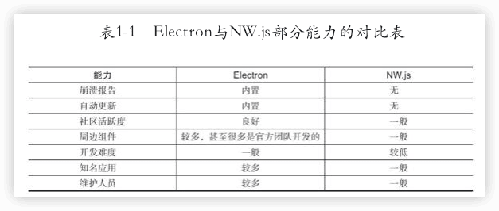

Electron实战：入门、进阶与性能优化
---

[Electron实战：入门、进阶与性能优化](https://book.douban.com/subject/35069275/)


## 前言


## 1 认识Electron

### Electron的由来


NW.js（https://nwjs.io）和Electron（https://electronjs.org），都是基于Chromium和Node.js实现的

王文睿（Roger Wang）

赵成（Cheng Zhao）

为了弥补Node.js和前端技术访问系统API方面的不足，这两个框架内部都**对系统API做了封装**，比如系统对话框、系统托盘、系统菜单、剪切板等。开发者基于Electron开发应用时，可以直接使用JavaScript访问这些API。

其他API，诸如**网络访问控制、本地文件系统的访问控制**等则由Node.js提供支持。

两个框架对于开发者来说差别并不是特别大，最主要的差别无过于Electron区分==主进程==和==渲染进程==。主进程负责**创建、管理渲染进程以及控制整个应用的生命周期**，渲染进程负责**显示界面及控制与用户的交互逻辑**。在Electron中主进程和渲染进程间通信需要经由`ipcMain`和`ipcRenderer`传递消息来实现。NW.js则无须关注这些问题，它需要关注的是所有窗口共享同一个Node.js环境带来的问题。




Electron最初由赵成和GitHub的工程师于2013年4月创建，当时名字为Atom Shell，用来服务于GitHub的开发工具Atom，2014年5月开源，2015年4月才正式更名为Electron。

### 基于Electron的应用

Visual Studio Code

MongoDB桌面版管理工具[Compass](https://www.mongodb.com/products/tools/compass)

社交通信领域风靡全球的Skype桌面版和WhatsApp桌面版、高效办公领域的Slack和飞书、视听领域的Nuclear（一款很有趣的音乐播放器）和WebTorrent Desktop（以P2P协议播放音视频的应用）、金融交易领域的OpenFin、早期的以太坊客户端Mist和Brave浏览器（由前Mozilla CEO和JavaScript之父Brendan Eich创建）等

Postman


https://github.com/electron/apps/blob/master/contributing.md#adding-your-app


### Electron的生态

==electron-builder==是一个Electron的构建工具，它提供了自动下载、自动构建、自动打包、自动升级等能力，是Electron生态中的基础支持工具，大部分流行的Electron应用都使用它进行构建和分发。

在Electron应用内存取本地数据，可以使用**Cookie、LocalStorage或IndexedDB**这些传统的前端技术，也可以选择Electron生态内的一些方案，例如**rxdb**是一个可以在Electron应用内使用的实时NoSQL数据库；如果希望使用传统的数据库，也可以在Electron内使用**SQLite**数据库。

**Vue CLI Plugin Electron Builder**和**electron-vue**是两个非常不错的工具，开发者可以基于它们轻松地在Electron应用内使用Vue及其组件（包括HMR热更新技术）。虽然后者拥有更多的GitHub star，更受欢迎，但我推荐使用前者。前者基于Vue CLI Plugin开发，更新频繁，而后者已经有近一年时间没更新过了。

**electron-react-boilerplate**是一个**项目模板**，它把Electron、React、Redux、React Router、Webpack和React Hot Loader组合在一起。开发者基于此模板可以快速构建React技术体系的Electron应用。

**angular-electron**也是一个项目模板，开发者可以基于它快速构建基于Angular和Electron的应用。

如果不希望使用上述前端框架，仅希望使用webpack与传统Web前端开发技术开发Electron应用，可以考虑使用electron-webpack组件完成工作。


[awesome-electron](https://github.com/sindresorhus/awesome-electron)

### Electron的优势


### Electron的不足

- 打包后的应用体积巨大

- 开发复杂度较大，进阶曲线较陡

- 版本发布过快

  幸好Electron的关键核心功能一直以来都是稳定的。

- 安全性问题

- 资源消耗较大

- 不支持老版本的Windows操作系统，比如Windows XP。

### 未来的竞争者PWA

PWA（Progressive Web App），即**渐进式Web应用**。MDN上的定义为：运用现代的Web开发技术以及传统的渐进式增强策略来创建跨平台Web应用程序。


PWA是传统Web应用向桌面端的延伸，它的本质还是一个Web应用；而Electron应用则是一个实实在在的传统桌面GUI应用。


## 2 轻松入门

### 2.1 搭建开发环境


```sh
yarn config set ELECTRON_MIRROR https://cdn.npm.taobao.org/dist/electron/
```


```sh
yarn global add electron
```


https://registry.npmmirror.com/-/binary/electron/


### Electron API演示工具

https://github.com/electron/electron-api-demos/releases


### 试验工具Electron Fiddle

验证一段简短的代码是否可以在Electron框架内正常运行

https://www.electronjs.org/fiddle

https://github.com/electron/fiddle/releases


## 3 主进程和渲染进程

