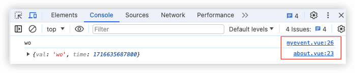
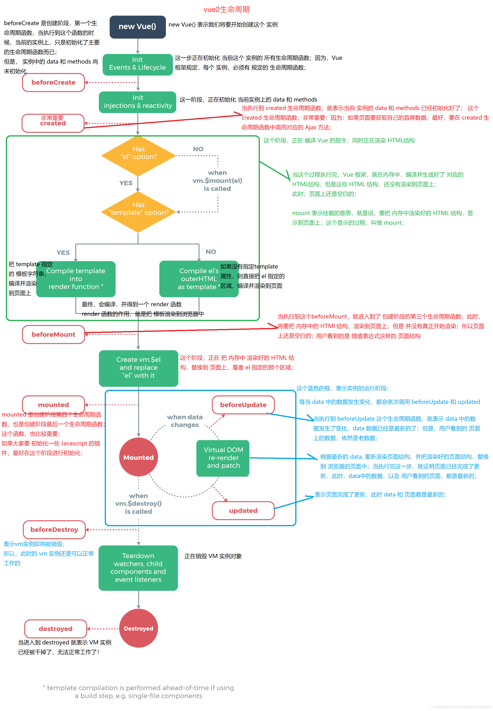

uniapp零基础入门
-----

## 1

https://www.bilibili.com/video/BV1mT411K7nW

https://gitee.com/qingnian8/uniapp-ling_project.git


### 为什么要学习uni-app？

1. 一套代码可以打包到不同的应用平台；
2. 方便入手，就是使用vue语法写小程序，如果有vue和小程序经验的话，甚至直接可以看文档，没有基础可以跟本门课程入门；
3. 丰富的生态环境，官方及第三方插件较为丰富，论坛活跃度高。


插件市场

### 能学到什么？

1. vue语法
2. 小程序文档与uni文档的差异化
3. API调用
4. 插件市场各种有趣的插件
5. 综合性的实例项目
6. 打包到不同类型的平台


HBuilder uni-app默认几个项目值得学习


[uni-app快速上手](https://uniapp.dcloud.net.cn/quickstart)


uni-app工程目录:


`<template>`中只能有一个唯一的根标签

## 2 组件

[组件使用的入门教程 | uni-app官网 (dcloud.net.cn)](https://uniapp.dcloud.net.cn/component/)

[小程序框架 / 逻辑层 / API (qq.com)](https://developers.weixin.qq.com/miniprogram/dev/component/)

uniapp组件 与 微信小程序类似

- 组件是视图层的基本组成单元。
- 组件是一个单独且可复用的功能模块的封装。

> 注意：所有组件与属性名都是小写，单词之间以连字符`-`连接。


`rpx`响应式单位


Uniapp的按钮样式比较少，可以选择 [Button 按钮|uView](https://xuqu.gitee.io/components/button.html)

### 页面跳转组件


`open-type`


### 导航菜单

全局文件page.json 配置


## 3 vue

单页面项目，最终都生成到一个index.html页面中。

组件

容器：`<template>`  


一个vue文件三个部分组成


vue是数据驱动

数据渲染


v-show 是隐藏dom还在 


v-html能解析HTML标签

```vue
<view v-html="title"></view>
```


`v-bind`   `:`   动态属性

`:src=""`  双引号里是js了


`v-on ` `@`


style绑定

```vue
<view :style="{background: bgcolor}"></view>

...
data() {
	return {
		bgcolor: "#c00"
	}
}
```


绑定class


`v-model` 双向绑定


计算属性会先调用缓存，相对于methods性能更好一点


## 4 

vue中组件没有本质区别，小程序中有稍微差别。

组件的两种注册方式：全局注册、局部注册

### 4.1 easycom自动导入自定义组件


### 4.2 通过子组件Porp为同组件传不同的值


### 4.3 props绑定动态值及数据类型默认值


### 4.4 emit子向父组件传值

父向子传值，子组件通过props接受父组件传过来的值


子组件一般不做数据处理。

子组件myevent.vue:

```vue
<template>
			<input type="text" placeholder="请输出...." @input="onInput"/>

</template>

<script>
	export default {
		//...
		methods: {
			onInput(e) {
				console.log(e.detail.value)
				// 子组件通过事件向父组件传值
				this.$emit('myeve', {val: e.detail.value, time: Date.now()})
			}
		}
	}
</script>

```

父组件：

```vue
<template>
	<view>

		<myevent title="组件间的传值" @myeve="onmyeve"></myevent>
	</view>
</template>

<script>
	export default {
	
		methods: {
			onmyeve(e) {
				console.log(e)
			}
		}
	}
</script>
```




### 4.5 native修饰符与父子间通信传值案例

自定义组件上写原生事件需要加`.native`，要不然会当成自定义事件。【vue3不需要了】

```vue
		<myevent title="组件间的传值" @myeve="onmyeve" @click.native="onClick"></myevent>
```


父子间通信案例

子组件mypop.vue:

```vue
<template>
	<view>
		<view>-----弹出框样式-----</view>
		<view class="box" :style="{height: state?'300rpx':'0'}"></view>
		<button size="mini" @click="onclose">关闭</button>
	</view>
</template>

<script>
	export default {
		name:"mypop",
		data() {
			return {
				
			};
		},
		props: {
			state: {
				type: Boolean,
				default: false
			}
		},
		methods: {
			onclose() {
				// 子组件中不能直接修改父组件传过来的值
				// this.state=false
				this.$emit('stateEve', false)
			}
		}
	}
</script>

```

父组件：

```vue
<template>
	<view>
		....
		<button @click="clickBtn">开启{{mystate}}</button>
		<mypop :state="mystate" @stateEve="onStateEve"></mypop>
	</view>
</template>

<script>
	export default {
		data() {
			return {
				about: '我们',
				mystate: false
			};
		},
		methods: {
			clickBtn() {
				this.mystate=true
			},
			onStateEve(e) {
				this.mystate=e
			}
		},
	}
</script>
```


### 4.6 sync修饰符及update的实现原理

父子间通信简化

🔖 vue3中使用v-model

```js
				// 通过.sync简化父子组件间通信，不需要自定义事件了
				this.$emit("update:state", false)
```


```vue
		<mypop :state.sync="mystate" ></mypop>
```


### 4.7 vue中的生命周期与小程序周期的对比



## 5 uniapp的api

uniapp的api文档结构与微信小程序的基本一致

### 5.1 uniapp路由与页面跳转的使用方式

页面跳转的两种方式：

1. 使用`navigator`标签

```vue
		<navigator url="/pages/demo4/demo4">跳转到demo4</navigator>
```

2. 在点击方法中调用`uni.navigateTo`方法

```js
			goDemo4() {
				uni.navigateTo({
					url:"/pages/demo4/demo4"
				})
			}
```


uni.redirectTo(OBJECT)：关闭当前页面，跳转到应用内的某个页面。

uni.reLaunch(OBJECT)：关闭所有页面，打开到应用内的某个页面。【可以跳转导航栏里的路由】【可以携带参数】

uni.switchTab(OBJECT)：类似reLaunch，但不能携带参数

uni.navigateBack()


### 5.2 onload页面传参与vueroute路由的差异


---界面---

### 5.3 uni.showToast交互反馈的用法


### 5.4 showLoading和showModal模态弹窗


### 5.5 showActionSheet从底部向上弹出操作菜单

```js
			clcikBox2() {
				// let that=this
				uni.showActionSheet({
					itemList:this.arr,
					// success: function(res) {  // 这种写法中this不是指向最外层，指向的uni.showActionSheet
					// 	console.log(that.arr[res.tapIndex])
					// },
					
					success:(res) => {  // 箭头函数中this指向最外层
						console.log(this.arr[res.tapIndex])
						
					}
				})
			}
```


### 5.6 动态设置当前页面的标题颜色及加载状态


### 5.7 tabbar配置iconfont字体图标

```json
	"tabBar": {
		"iconfontSrc": "static/fonts/iconfont.ttf",  // 从iconfont.cn下载的
		"list": [
			{
				"text": "首页",
				"pagePath": "pages/index/index",
				"iconfont": {
					"text": "\ue7c6",
					"selectedText": "\ue600"
				}
				
			},
			{
				"text": "新闻",
				"pagePath": "pages/list/list",
				"iconfont": {
					"text": "\ue7f4",
					"selectedText": "\ue650"
				}
			},
			{
				"text": "用户",
				"pagePath": "pages/user/user",
				"iconfont": {
					"text": "\ue7ae",
					"selectedText": "\ue677"
				}
			}
		]	
	}
```


> 小程序不支持iconfont，只能使用iconpath


### 5.8 动态设置tabBar的各项内容


### 5.9 uni.requests网络请求API接口

随机狗子： https://dog.ceo/api/breeds/image/random

随机猫咪： https://api.thecatapi.com/v1/images/search?limit=1

免费测试api接口： https://jsonplaceholder.typicode.com/posts   https://jsonplaceholder.typicode.com

土味情话：https://jsonplaceholder.typicode.com/posts


### 5.10 request的其他参数说明


