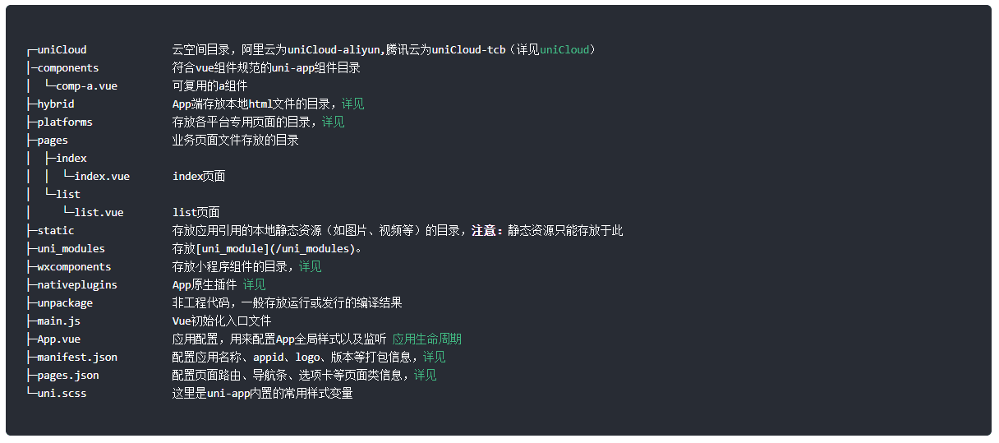

uniapp零基础入门
-----

## 1

https://www.bilibili.com/video/BV1mT411K7nW

https://gitee.com/qingnian8/uniapp-ling_project.git

### 为什么要学习uni-app？

1. 一套代码可以打包到不同的应用平台；
2. 方便入手，就是使用vue语法写小程序，如果有vue和小程序经验的话，甚至直接可以看文档，没有基础可以跟本门课程入门；
3. 丰富的生态环境，官方及第三方插件较为丰富，论坛活跃度高。

插件市场

### 能学到什么？

1. vue语法
2. 小程序文档与uni文档的差异化
3. API调用
4. 插件市场各种有趣的插件
5. 综合性的实例项目
6. 打包到不同类型的平台

HBuilder uni-app默认几个项目值得学习

[uni-app快速上手](https://uniapp.dcloud.net.cn/quickstart)

uni-app工程目录:

`<template>`中只能有一个唯一的根标签

## 2 组件

[组件使用的入门教程 | uni-app官网 (dcloud.net.cn)](https://uniapp.dcloud.net.cn/component/)

[小程序框架 / 逻辑层 / API (qq.com)](https://developers.weixin.qq.com/miniprogram/dev/component/)

uniapp组件 与 微信小程序类似

- 组件是视图层的基本组成单元。
- 组件是一个单独且可复用的功能模块的封装。

> 注意：所有组件与属性名都是小写，单词之间以连字符`-`连接。

`rpx`响应式单位

Uniapp的按钮样式比较少，可以选择 [Button 按钮|uView](https://xuqu.gitee.io/components/button.html)
