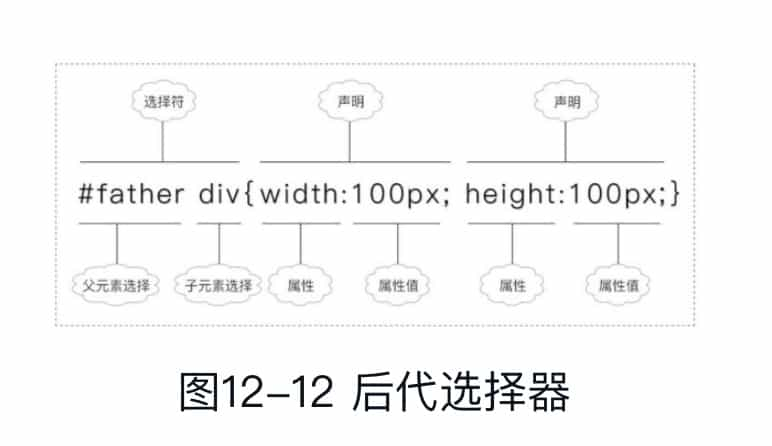
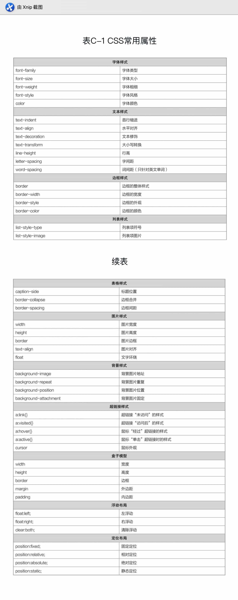

《从0到1：HTML+CSS快速上手》笔记
--------


# 一、HTML基础

## 1 HTML简介

前端开发者最核心的3个技术：HTML、CSS和JavaScript。

HTML（Hyper Text Markup Language，超文本标记语言），HTML是一门描述性语言。

CSS（Cascading Style Sheets，层叠样式表），是用来控制网页外观的一种技术。

JavaScript是一种嵌入到HTML页面中的脚本语言，由浏览器一边解释一边执行。

> HTML用于控制网页的**结构**，CSS用于控制网页的**外观**，而JavaScript控制着网页的**行为**。

前端构建工具：webpack、gulp和babel等。

对于前端初学者来说，千万别想着精通了一门技术，再去精通另一门技术。在Web领域，不少技术之间都有着交叉关系，只有“通”十行才可能做到“精”一行。

HTML一般是指HTML4.01；HTML5一般指相对于HTML4.01“新增加的内容”；准确的讲，HTML = HTML4.01 + HTML5。

## 2 开发工具

## 3 基本标签

### 3.1 HTML结构

一个页面是由4个部分组成的：

文档声明：`<!DOCTYPE html>`

html标签对：`<html></html>`

head标签对：`<head></head>`

body标签对：`<body></body>`


### 3.2 head标签

一般只有6个标签能放在head标签内。

1. title标签

1. meta标签

定义页面的特殊信息，如页面关键字、页面描述等，告诉搜索引擎蜘蛛（如百度蜘蛛、谷歌蜘蛛）这个页面是做什么的。

两个重要的属性：name和http-equiv。

```html
<!DOCTYPE html>
<html>
	<head>    
		<!--网页关键字-->    
		<meta name="keywords" content="绿叶学习网,前端开发,后端开发"/>    
		<!--网页描述-->    
		<meta name="description" content="绿叶学习网是一个富有活力的Web技术学习网站"/>    
		<!--本页作者-->    
		<meta name="author" content="helicopter">    
		<!--版权声明-->    
		<meta name="copyright" content="本站所有教程均为原创，版权所有，禁止转载。否则必将追究法律责任。"/>
	</head>
	<body>
	</body>
</html>
```


http-equiv属性只有两个重要作用：

定义网页所使用的编码
```html
<meta http-equiv="Content-Type" content="text/html; charset=utf-8"/>
````

H5中可简化成：
```html
<meta charset="utf-8"/>
```
定义网页自动刷新跳转
```html
<meta http-equiv="refresh" content="6;url=http://www.lvyestudy.com"/>
```
这段代码表示当前页面在6秒后会自动跳转到http://www.lvyestudy.com这个页面。实际上，很多“小广告”网站就是用这种方式来实现页面定时跳转的。

1. link标签

用于引入外部样式文件（CSS文件）。

1. style标签

定义元素的CSS样式。

1. script标签

定义页面的JavaScript代码，也可以引入外部JavaScript文件。

1. base标签

可忽略

### 3.3 body标签

### 3.4 HTML注释

## 4 文本

### 4.1 文本简介

大多数静态页面4种元素组成：

文字

图片

超链接

音频和视频

静态页面和动态页面的区别在于**是否与服务器进行数据交互**。

### 4.2 标题标签`<h>`

共：h1、h2、h3、h4、h5、h6。一个页面一般只能有一个h1标签，而h2到h6标签可以有多个

### 4.3 段落标签

段落标签`<p></p>` （paragraph）

换行标签`<br/>`（break）

p标签会自动换行，并且段落与段落之间有一定的间距。

br标签是用来给文字**换行**的，而p标签是用来给文字**分段**的。

### 4.4 文本标签

常用的文本标签有8种：

粗体标签：strong、b

斜体标签：i、em、cite

上标标签：sup（superscripted）

下标标签：sub （subscripted）

中划线标签：s

下划线标签：u

大字号标签：big

小字号标签：small


s、u、big、small，一般会用CSS来实现。

### 4.5 水平线标签

`<hr/>` （horizon，水平线）

### 4.6 div标签

div（division，分区）

### 4.7 自闭合标签

一般标签和自闭合标签


### 4.8 块元素和行内元素


### 4.9 特殊符号

空格：`&nbsp`

1个汉字约等于3个“&nbsp;”。


## 5 列表

列表共有3种：有序列表、无序列表和定义列表。

### 有序列表
```html
<ol type="属性值">
<li>列表项</li>
<li>列表项</li> 
<li>列表项</li>
</ol>
```

ol，ordered list（有序列表）；li，list（列表项）。

`<ol>`标签的子标签也只能是li标签。


### 无序列表

```html
<ul type="属性值">
<li>列表项</li>
<li>列表项</li> 
<li>列表项</li>
</ul>
```

ul，unordered list（无序列表）。

ul标签和li标签也需要配合一起使用，不可以单独使用。


ul的子元素只能是li，不能是其他元素。也就是说，文本不能直接放在ul元素内。

### 定义列表

```html
<!DOCTYPE html>
<html>
	<head>
	    <meta charset="utf-8" />
	    <title>定义列表</title>
	</head>
	<body>
	    <dl> 
	    	<dt>HTML</dt> 
	    	<dd>制作网页的标准语言，控制网页的结构</dd> 
	    	<dt>CSS</dt> 
	    	<dd>层叠样式表，控制网页的样式</dd> 
	    	<dt>JavaScript</dt> 
	    	<dd>脚本语言，控制网页的行为</dd> 
	    </dl>
	</body>
</html>
```

dl即definition list（定义列表），dt即definition term（定义名词），而dd即definition description（定义描述）。


### HTML语义化

HTML的精髓就在于标签的语义。语义化是非常重要的一个思想。

div和span是无语义的标签，应该优先使用其他有语义的标签

语义化对于搜索引擎优化（即SEO）极其重要。

## 6 表格

### 基本结构

3个部分：

表格：table标签

行：tr标签（table row）

单元格：td标签（table data cell）

### 完整结构

表格标题：caption

表头单元格：th（table header cell）

```html
<table> 
	<caption>考试成绩表</caption> 
	<tr> 
		<th>姓名</th> 
		<th>语文</th> 
		<th>英语</th> 
		<th>数学</th> 
	</tr> 
	<tr> 
		<td>小明</td> 
		<td>80</td> 
		<td>80</td> 
		<td>80</td> 
	</tr> 
	<tr> 
		<td>小红</td> 
		<td>90</td> 
		<td>90</td> 
		<td>90</td> 
	</tr> 
	<tr> 
		<td>小杰</td> 
		<td>100</td> 
		<td>100</td> 
		<td>100</td> 
	</tr> 
</table>
```

更进一步的语义化：thead、tbody和tfoot

### 合并行：rowspan

### 合并列：colspan

??

rowspan表示“row span”，colspan表示“column span”

## 7 图片

img标签3主要个属性：src、alt和title。

alt，title都是图片描述，alt针对搜索引擎，图片无法显示时会显示alt；title针对用户，鼠标悬停时显示title。

### 图片格式

??

## 8 超链接

`<a></a>`

target属性来定义打开窗口的方式，默认`_self`是原窗口，`_blank`是新窗口。

### 内部链接

外部链接指向的是“外部网站的页面”，而内部链接指向的是“自身网站的页面”。

### 锚点链接

锚点链接其实是内部链接的一种。

实现锚点链接：

目标元素的id；

a标签的href属性指向该id。

## 9 表单

表单最重要的作用就是在浏览器端收集用户的信息，然后将数据提交给服务器来处理。

表单标签有5种：form、input、textarea、select和option。

表单可分为8种：

单行文本框

密码文本框

单选框

复选框

按钮

文件上传

多行文本框

下拉列表


size属性一般不用，使用CSS来控制。

密码文本框与单行文本框类似，属性也相同。

### 单选框

name属性表示单选按钮所在的组名，而value表示单选按钮的取值，这两个属性必须要设置。

checked属性

对于同一组的单选框，必须要设置一个相同的name。

一般情况下，value属性取值与后面的文本是相同的。之所以加上value属性，是为了方便JavaScript或者服务器操作数据。实际上，所有表单元素的value属性的作用都是一样的。

### 按钮

3种按钮：普通按钮（button），提交按钮（submit），重置按钮（reset）

### 多行文本框

```html
<textarea rows="行数" cols="列数" value="取值">默认内容</textarea>
```

## 10 框架

Iframe标签，内嵌框架，是指在当前页面再嵌入另外一个网页。

```html
<iframe src="链接地址" width="数值" depth="数值"></iframe>
```

# 二、CSS基础

CSS3，一般指的是相对于CSS2“新增加的内容”。

CSS引入方式有3种：

1. 外部样式表

```html
<link rel="stylesheet" type="text/css" href="文件路径" />
```

rel即relative

1. 内部样式表

```html
<style type="text/css"> 
……
</style>
```

3. 行内样式表

4. @import

@import方式与外部样式表很相似。不过在实际开发中，我们极少使用@import方式，而更倾向于使用link方式（外部样式）。原因在于@import方式是先加载HTML后加载CSS，而link是先加载CSS后加载HTML。如果HTML在CSS之前加载，页面用户体验就会非常差。

## 12 CSS选择器

在HTML中，id和class是元素最基本的两个属性。

选择器，就是指用一种方式把你想要的那个元素选中。

最实用的5种选择器：元素选择器，id选择器，class选择器，后代选择器，群组选择器。

CSS选择器的格式：

```
选择器 {    
	属性1 : 取值1;
   ……    
	属性n : 取值n; 
}
```




## 13 字体样式


粗细指的是字体的“肥瘦”，而大小指的是字体的“宽高”。


### CSS注释

## 14 文本样式

字体样式针对的是“文字本身”的形体效果，而文本样式针对的是“整个段落”的排版效果。


### 行高：line-height

??

## 15 边框样式

几乎所有的元素都可以定义边框。


### 局部样式

??

## 16 列表样式

### 列表项符号：list-style-type


只需要记住“list-style-type:none;”这一个就可以了，其他的不需要记住。因为在实际开发中，对于使用list-style-type属性来定义列表项符号，几乎用不上。

### 列表项图片：list-style-image

list-style-image: url(图片路径)

## 17 表格样式

## 18 图片样式

## 19 背景样式


??

## 20 超链接样式

### 超链接伪类


### 鼠标样式


## 21 盒子模型


## 22 浮动布局

??

## 23 定位布局

定位布局共有4种方式：

固定定位（fixed）。相对定位（relative）。绝对定位（absolute）。静态定位（static）。

# 附录A HTML常用标签


# 附录B 常用表单标签


# 附录C CSS常用属性



# 附录D W3C十六色

