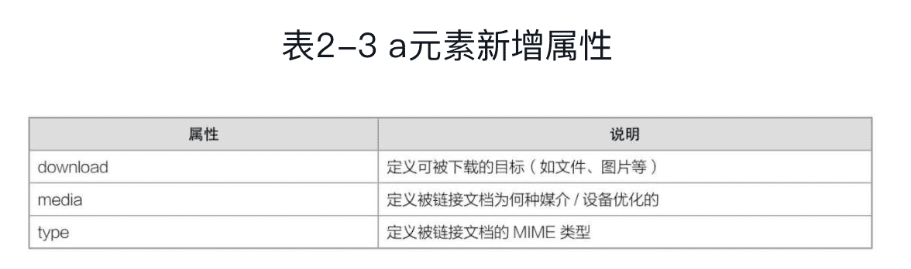
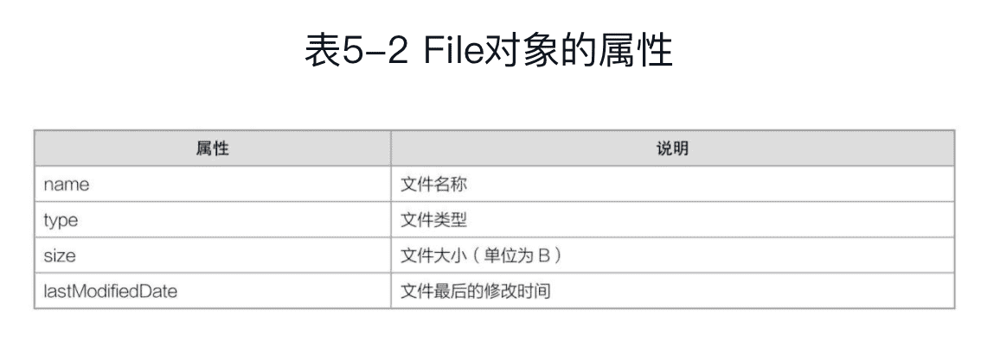

《从0到1：HTML5+CSS3修炼之道》笔记
------

www.lvyestudy.com

## 一、HTML5实战

HTML5的W3C官方地址：https://www.w3.org/TR/html5/

HTML5的MDN官方地址：https://developer.mozilla.org/zh-CN/docs/Web/Guide/HTML/HTML5

### 1 HTML5简介

#### HTML、XHTML和HTML5

HTML，HyperText Mark-up Language，超文本标记语言，一般指HTML4.01。

XHTML，EXtensible HyperText Mark-up Language，扩展的超文本标记语言，它是XML风格的HTML4.01，是更严格、更纯净的HTML4.01，可以看作是HTML4.01的过渡版本。

XHTML和HTML的主要区别：

1. XHTML标签必须被关闭
2. XHTML标签以及属性必须小写
3. XHTML标签属性必须用引号（单引号、双引号都可以）
4. XHTML标签用id属性代替name属性（除了表单元素之外）

HTML5是HTML4.01的升级版，它有几个特点：

1. 文档类型简写

2. 字符编码简写

3. 标签不再区分大小写（建议小写）

4. 允许属性值不加引号（建议加）

5. 允许部分属性的属性值省略

   ```html
   <input type="text" readonly/>
   <input type="checkbox" checked/>
   ```

   等价于：

   ```html
   <input type="text" readonly="readonly"/>
   <input type="checkbox" checked="checked"/>
   ```

   

### 2 新增元素

#### 2.1 结构元素

在HTML5之前，对于页面中较大块的结构（如导航、内容区、侧边栏、底部等），一般都是使用div元素来实现。

HTML5新增了一组结构元素，用来帮助完善页面的**语义化**，提高**可读性、可维护性以及SEO**（即搜索引擎优化）。

新增的主要结构元素有6个：header、nav、article、aside、section、footer。

##### header

一般用于3个地方：**页面头部、文章头部（article元素）和区块头部（section元素）**。

用于页面头部时，header元素一般包含网站名称、页面LOGO、顶部导航、介绍信息等。

用于文章头部时，header元素一般包含“文章标题”和“meta信息”（一般指的是作者、点赞数、评论数等）。所谓的meta信息，

用于区块头部时，header元素一般只包含区块的标题内容。

```html
<!DOCTYPE html>
<html>
<head>
  <meta charset="utf-8" />
  <title></title>
</head>
<body>
  <header></header>
  <nav></nav>
  <article>
   <header></header>
   ……
   <footer></footer>
  </article>
  <aside></aside>
  <section>
   <header></header>
    ……
  </section>
  <footer></footer>
</body>
</html>
```

对应的HTML结构图：


##### nav

一般用于3个地方：**顶部导航、侧栏导航和分页导航**。

当用于顶部导航时，nav元素可以放到header元素内部，也可以放到header元素外部。

##### article

一般只会用于1个地方：**文章内容部分**。

article元素内部可以包含header元素、section元素和footer元素等。

```html
<article>
	<header>
    <h1>HTML5是什么？</h1>
    <p>作者、点赞、评论、浏览……</p>
  </header>
  <div id="content">文章内容……</div>
  <footer>
    <nav>上一篇、下一篇导航</nav>
  </footer>
</article>
```

##### aside

一般用于表示跟周围区块相关的内容。根据使用位置，分两种情况：

1. 如果aside元素放在article元素或section元素之中，则aside内容必须与article内容或section内容紧密相关。
2. 如果aside元素放在article元素或section元素之外，则aside内容应该是与整个页面相关的，比如相关文章、相关链接、相关广告等。

##### section

一般用于某一个需要标题内容的区块。HTML5标准建议，section元素内部必须带有标题（header元素）。

如果页面某个区块不需要标题，直接使用div元素就可以了。

article、aside这两个元素可以看成是“特殊”的section元素，因为它们比section元素更具有语义化。在实际开发中，对于页面某一个区块，优先考虑语义化更好的article元素和aside元素，如果这两个都不符合，再考虑使用section元素。

##### footer元素

一般用于2个地方：“页面底部”和“文章底部”。

用于页面底部时，一般包含**友情链接、版权声明、备案信息**等。

用于文章底部时，也就是放在article元素内部时，一般包含**“上一篇/下一篇导航”，“文章分类”，“发布信息”**等。

#### 2.2 表单元素

##### 新增input元素类型


##### 新增其他表单元素

output、datalist、keygen

###### output

output元素是行内元素，只比span元素更具有语义化。一般放在form元素内部，并且配合其他表单元素（如文本框等）来使用。

```html
<!DOCTYPE html>
<html>
<head>
    <meta charset="utf-8" />
    <title></title>
    <script>
        window.onload = function(){
            var input = document.getElementsByTagName("input")[0];
            var output = document.getElementsByTagName("output")[0];
            //获取range的初始值
            output.value = input.value;
            //拖动滑动条，改变output值
            input.onchange = function(){
                output.value = input.value;
            };
        }
    </script>
</head>
<body>
<form method="post">
    <input type="range" min="-10" max="10" step="5" value="-10"/>
    <output></output>
</form>
</body>
</html>
```

###### datalist

datalist元素为文本框提供一个可选的列表。

```html
<!DOCTYPE html>
<html>
<head>
    <meta charset="utf-8" />
    <title></title>
</head>
<body>
<form method="post">
    输入网址：<input type="text" list="urlList"/>
    <datalist id="urlList">
        <option label="欣欣向戎" value="http://andyron.com"></option>
        <option label="GitHub" value="https://github.com/andyron"></option>
        <option label="异步社区" value="http://www.epubit.com"></option>
    </datalist>
</form>
</body>
</html>
```


###### keygen

使用keygen元素来生成页面的密钥。兼容性很差。

#### 2.3 其他新增元素

##### address 

使用更具有语义化的address元素来为“整个页面”或者“某一个article元素”添加地址信息（电子邮件或真实地址）。

##### time

##### progress

动态进度条

##### meter

静态进度条

##### figure和figcaption

“图片+图注”效果

##### fieldset和legend

使用fieldset元素来给表单元素进行分组。其中，legend元素用于定义某一组表单的标题。

```html
<!DOCTYPE html>
<html>
<head>
  <meta charset="utf-8" />
  <title></title>
</head>
<body>
  <form action="index.php" method="post">
     <fieldset>
      <legend>登录xxxx</legend>
      <p>
        <label for="name">账号：</label>
        <input type="text" id="name" name="name" />
      </p>
      <p>
        <label for="pwd">密码：</label>
        <input type="password" id="pwd" name="pwd" />
      </p>
      <input type="checkbox" id="remember-me" name="remember-me" />
      <label for="remember-me">记住我</label>
      <input type="submit" value="登录" />
     </fieldset>
  </form>
</body>
</html>
```


#### 2.4 改良后的元素

##### a



##### ol

新增了一个reversed属性，用于设置列表顺序为降序显示。

##### small

使用更具有语义化的small元素来表示“小字印刷体”的文字。small元素一般用于网站底部的免责声明、版权声明等。

##### script

新增了两个属性：defer和async。作用都是加快页面的加载速度。两者区别：

- defer属性用于异步加载外部JavaScript文件，当异步加载完成后，该外部JavaScript文件不会立即执行，而是等到整个HTML文档加载完成才会执行。
- async属性用于异步加载外部JavaScript文件，当异步加载完成后，该外部JavaScript文件会立即执行，即使整个HTML文档还没有加载完成。

### 3 新增属性

#### 3.1 公共属性

公共属性：可以应用于大多数元素的属性。

##### hidden

##### draggable

##### contenteditable

定义某个元素的内容是否可以被编辑>

##### data-*

为元素实现自定义属性。


#### 3.2 input元素的新增属性

##### autocomplete

来实现文本框的自动提示功能（之前键入过的值）。

autocomplete属性适用于所有文本框型的input元素，包括text、password、email、url、tel等。

##### autofocus

文本框自动获取焦点。

也适用于所有文本框型的input元素。

##### placeholder

为文本框添加提示内容。

也适用于所有文本框型的input元素。

##### required

定义文本框输入内容不能为空。也适用于所有文本框型的input元素。

##### pattern

为文本框添加验证功能（正则）。


#### 3.3 form元素的新增属性

##### novalidate

使用novalidate属性来禁用form元素的所有文本框内置的验证功能。

### 4 元素拖放

`draggable="true"`

**“源元素”**指的是被拖曳的那个元素，**“目标元素”**指的是源元素最终被释放到的那个元素。


#### 4.2 dataTransfer对象


### 5 文件操作

文件上传input元素有两个重要属性：multiple和accept。

multiple属性表示“是否选择多个文件”。

accept属性用于设置文件的过滤类型（MIME类型），常见的accept属性取值（同时设置多个过滤类型，使用`,`隔开）：


#### File对象



#### FileReader对象


#### Blob对象


### 6 本地存储

Cookie的限制：

- 大小限制：大多数浏览器支持最大为4KB的Cookie。
- 数量限制：大多数浏览器只允许每个站点存储20个Cookie，如果想要存储更多Cookie，则旧的Cookie将会被丢弃。
- 有些浏览器还会对它们将接收的来自所有站点的Cookie总数做出绝对限制，通常为300个。
- Cookie默认情况下都会随着HTTP请求发送到后台，但是实际上大多数请求都是不需要Cookie的。

为了解决Cookie的限制，HTML5新增了3种全新的数据存储方式：localStorage、sessionStorage和indexedDB。其中，localStorage用于**永久**保存客户端的**少量数据**，sessionStorage用于**临时**保存客户端的**少量数据**，而indexedDB用于**永久**保存客户端的**大量数据**。

#### localStorage


#### sessionStorage


localStorage和sessionStorage对比：

- localStorage和sessionStorage都是window对象下的子对象。

- 两者具有完全相同的操作，比如获取数据使用的是getItem()，保存数据使用的是setItem()等。

- localStorage对象保存的是“永久数据”，而sessionStorage对象保存的是“临时数据”。

- 在实际开发中，localStorage用得比较多，sessionStorage很少用到，我们只需要重点掌握localStorage就行。

#### indexedDB

一种存储在客户端本地的NoSQL数据库，用于在本地存储大量数据。

### 7 音频视频

#### 7.1 视频音频简介

对于音频，使用audio元素来开发；对于视频，使用video元素来开发。

#### 7.2 开发视频

video元素


HTML5视频格式主要有3种：ogg、mp4和webm。


#### 7.3 开发音频

audio元素

HTML5音频格式主要有3种：ogg、mp3和wav。


### 8 离线应用


```html
<!DOCTYPE html>
<html manifest="cache.manifest" >
<head>
  
</head>
  ……
</html>

```


### 9 多线程处理

Web Worker其实就是HTML5提供的“JavaScript多线程”解决方案。

Web Worker技术基本原理就是：在当前JavaScript的主线程中，使用Worker()构造函数新建一个worker实例，然后加载某一个JavaScript文件，发送给一个后台线程来处理（注意，这里是后台线程）。


### 10 地理位置

```javascript
window.navigator.geolocation
```


```javascript
navigator.geolocation.getCurrentPosition(function(position){
  ……
}, error, option);
```

第1个参数是一个回调函数，表示在成功获取到当前地理位置后才会执行；

第2个参数也是一个回调函数，表示在获取当前地理位置失败时才会去执行；

第3个参数是一些可选属性的列表，它包含多个属性。


#### 百度地图

!!

### 11 桌面通知??


```javascript
var notice = new Notification(title, options);
```

使用Notification()这个构建函数来创建一个桌面通知。title是必选参数，表示通知框的标题内容；options是一个对象，用来设置一些可选参数。


### 12 Canvas

#### 12.1 Canvas是什么

##### Canvas用途

1．绘制图形

2．绘制图表

3．动画效果

4．游戏开发

##### Canvas与SVG

Canvas是使用JavaScript动态生成的，SVG是使用XML静态描述的。前者是“位图”，后者是“矢量图”。

#### 12.2 Canvas元素


## 二、CSS3实战

### 13 CSS3简介

CSS3相对于CSS2.1来说，新增了大量属性，不仅可以让页面更加酷炫，最重要的是可以提高网站的可维护性以及访问速度。

#### 浏览器私有前缀

由于CSS3新增的一些属性尚未成为W3C标准的一部分，因此对于这些属性来说，每种内核的浏览器都只能识别“带有自身私有前缀的属性”。


不过，现在主流浏览器最新版本对CSS3的支持都特别好，我们已经不需要再去为大多数属性做兼容处理了。

### 14 新增选择器

#### 属性选择器

#### 结构伪类选择器

#### UI伪类选择器


### 15 文本样式


#### 文本阴影：text-shadow


#### 文本描边：text-stroke


#### 文本溢出：text-overflow


#### 强制换行：word-wrap、word-break


#### 嵌入字体：@font-face


### 16 颜色样式


#### opacity透明度


#### RGBA颜色


#### CSS3渐变


### 17 边框样式


#### 圆角效果：border-radius


#### 边框阴影：box-shadow


#### 多色边框：border-colors


#### 边框背景：border-image


### 18 背景样式


#### 背景大小：background-size


#### 背景位置：background-origin


#### 背景剪切：background-clip


#### 多背景图片


### 19 CSS3变形

在CSS3中，动画效果包括3个部分：变形（transform）、过渡（transition）、动画（animation）。


#### 平移：translate()


#### 缩放：scale()


#### 倾斜：skew()


#### 旋转：rotate()


#### 中心原点：transform-origin


### 20 CSS3过渡

在CSS3中，我们可以使用transition属性将元素的某一个属性从“一个属性值”在指定的时间内平滑地过渡到“另一个属性值”，从而实现动画效果。

语法：

```css
transition: 过渡属性 过渡时间 过渡方式 延迟时间;
```


#### 过渡属性：transition-property


#### 过渡时间：transition-duration


#### 过渡方式：transition-timing-function


#### 延迟时间：transition-delay


#### 深入了解transition属性


### 21 CSS3动画


#### @keyframes


#### 动画名称：animation-name


#### 持续时间：animation-duration


### 22 多列布局


### 23 滤镜效果

```css
filter: 取值;
```


### 24 弹性盒子模型


### 25 其他样式

#### 25.1 outline属性


#### 25.2 initial取值


#### 25.3 calc()函数


#### 25.4 overflow-x和overflow-y


## 附录

### HTML5新增元素


### HTML5新增属性


### CSS3新增选择器


### CSS3新增属性

