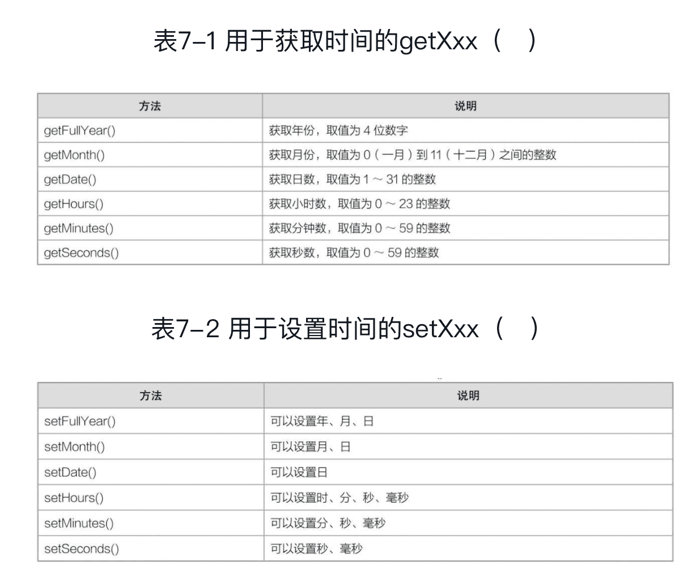
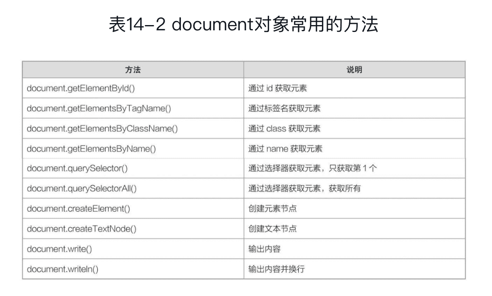
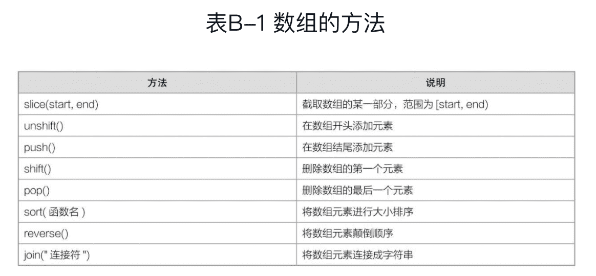
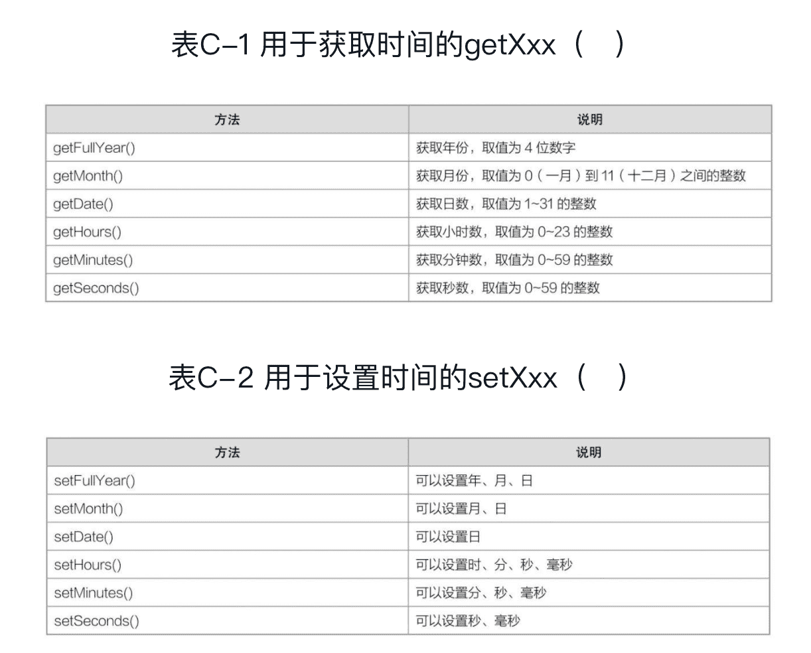

《从0到1：JavaScript快速上手》笔记
-------


# 一、语法基础

## 1 JavaScript简介

### JavaScript引入方式

#### 外部JavaScript

可以放在head标签里也可以放在body标签里。
```html
<script src="index.js"></script>
```

src，是“source（源）”

#### 内部JavaScript

```html
<script type="text/javascript">

......

</script>
```

简写为：
```html
<script>

......

</script>
```

#### 元素事件JavaScript

就是在元素的“事件属性”中直接编写JavaScript或调用函数。

```html
<input type="button" value="按钮" onclick="alert('hello world!')" />
```
```javascript
// 页面打开时

window.onload=function() {

}

// 页面关闭时

window.onbeforeunload=function(event) {

var e=event || window.event;

e.returnValue="!!";

}
```

## 2 语法基础

### 2.2 变量与常量
```javascript
var a = 10;

var b = 20,c = 30;

// 常量用大写
var DEBUG = 1;
```


变量由字母、下划线、`$`或数字组成，并且第一个字母必须是字母、下划线或`$`。

变量不能是系统关键字和保留字。

所有JavaScript变量都由`var`声明。


### 2.3 数据类型

**基本数据类型：**数字、字符串、布尔值、未定义值（undefined）和空值（null）。

**引用数据类型：**对象（数组也是属于对象的一种）。

JavaScript中的数字是不区分“整型（int）”和“浮点型（float）”的。

字符串都是用英文单引号或英文双引号括起来的。单引号括起来的字符串中可以包含双引号，双引号括起来的字符串中可以包含单引号。

### 2.4 运算符

#### 算术运算符


#### 赋值运算符


#### 比较运算符


#### 逻辑运算符


#### 条件运算符

```
var a = 条件 ? 表达式1 : 表达式2;
```

### 2.5 表达式与语句

“语句就是JavaScript的一句话”，而“表达式就是一句话的一部分”。


### 2.6 类型转换

1. 隐式类型转换
2. 显式类型转换

**“字符串”转换为“数字”：**

`Number()`：只能将纯“数字型字符串”转换为数。

`parseInt()`和`parseFloat()`：parseInt()会提取整数部分，parseFloat()不仅会提取整数部分，还会提取小数部分。

`NaN`指的是“Not a Number（非数字）”。

**“数字”转换为“字符串”：**

与空字符串相加

`toString()`

### 2.7 转义字符

```javascript
\'
\"
\n
```

### 2.8 注释

```javascript
//

/* */
```


## 3 流程控制

### 顺序结构

### 选择结构
```javascript
单向选择：if...

双向选择：if...else...

多向选择：if...else if...else...


switch ()

{

  case 取值1:

  		语块1; break;

  case 取值2:

  		语块2; break;

  ......

  case 取值n:

  		语块n; break;

  default:

  		语块n+1;

}
```

switch是“开关”,case是“情况”,break是“断开”,default是“默认”。

### 循环结构

在JavaScript中，循环语句指的是在“满足某个条件下”循环反复地执行某些操作的语句。
```javascript
while语句

do...while语句

for语句
```

## 4 函数

函数一般会在两种情况下使用：**一种是“重复使用的功能”，另外一种是“特定的功能”**。

使用函数的2步：① 定义函数；② 调用函数。

### 4.2 函数的定义

使用`function`来定义两种函数：

#### 没有返回值的函数

函数跟变量非常相似，变量用var来定义，而函数用function来定义。变量需要取一个变量名，而函数也需要取一个函数名。

#### 有返回值的函数

`return`

#### 全局变量与局部变量

全局变量一般在主程序中定义，其有效范围是从定义开始，一直到整个程序结束。

局部变量一般在函数中定义，其有效范围只限于在函数中。

### 4.3 函数的调用

如果一个函数只是被定义而没有被调用，那么函数本身是不会执行的。

JavaScript函数调用和其它编程语言不同，它有四种调用方式：

#### 直接调用

#### 在表达式中调用

一般用于“有返回值的函数”，函数的返回值会参与表达式的计算。

#### 在超链接中调用

指的是在a元素的href属性中用“javascript：函数名”的形式来调用函数。当用户点击超链接时，就会调用该函数。

```html
<a href="javascript:函数名"></a>
```


#### 在事件中调用

JavaScript是一门基于事件的语言。

```html
<script>
	function alertMes() 
  {
    ......
  }
</script>
......
<input type="button" onclick="alertMes()" value="提交"/>
```

### 4.4 嵌套函数

在内部定义的函数只能在内部调用。

嵌套函数的功能非常强大，并且跟JavaScript最重要的一个概念“闭包”有重要的关系。

### 4.5 内置函数


函数高级部分的内容包括this、闭包、类、继承、递归函数、高阶函数等。

## 5 字符串对象

在JavaScript中，对象分两种：“自定义对象”和“内置对象”。

常用内置对象有4种：

字符串对象：`String`

数组对象：`Array`

日期对象：`Date`

数值对象：`Math`

### 获取字符串长度

```javascript
str.length
```

### 大小写转换

```javascript
str.toLowerCase()
str.toUpperCase()
```

### 获取某一个字符

```javascript
str.charAt(n)
```

### 截取字符串

```javascript
str.substring(start, end)
```

截取范围为“[start,end）”，也就是包含start，但不包含end。其中，end可以省略。当end省略时，截取的范围为“start到结尾”。

### 替换字符串

```javascript
str.replace(原字符串, 替换字符串)
str.replace(正则表达式, 替换字符串)
```

### 分割字符串

```javascript
str.split("分隔符")
```

### 检索字符串的位置

```javascript
str.indexOf("指定字符串")
str.lastIndexOf("指定字符串")
```

前者返回首次出现的下标，后者返回最后出现的下标，不存在都返回-1。

## 6 数组对象

```javascript
// 数组的创建
var 数组名 = new Array(元素1, 元素2, ...);  // 完整形式
var 数组名 = [元素1, 元素2, ...];  // 简写形式

// 数组的获取
arr[3]

// 数组的赋值
arr[i] = 值;

// 获取数组长度
arr.length;

// 截取数组某部分
arr.slice(start, end);  // 与字符串的substring类似

// 添加数组元素
// 开头添加
arr.unshift(element1, element2, ......);
// 结尾添加            
arr.push(element1, element2, ......);   

// 删除数组元素
// 删除开头第一个元素
arr.shift()
// 删除最后一个元素
arr.pop()
```

`unshift()`、`push()`、`shift()`、`pop()`这4个方法都会改变数组的结构。

```javascript
// 比较
arr.sort(函数名);

// 颠倒数组顺序
arr.reverse();

// 将数组元素连接成字符串
arr.join("连接符");
```


## 7 时间对象

```javascript
var oDate = new Date();
```



虽然时间对象Date看似用途多，但是在实际开发中却用得比较少，除非是在特定领域，如电影购票、餐饮订座等。

```javascript
// 获取星期几，0表示星期天，1表示星期一，……,6表示星期六
oDate.getDay();
```

## 8 Math对象

凡是涉及动画开发、高级编程、算法研究等内容的，都跟数学有极大的联系。

Math对象跟其他对象不一样，Math对象不需要使用`new`关键字来创造，而可以直接使用它的属性和方法。

```javascript
Math.属性
Math.方法
```

### 属性


### 方法


### 最大值与最小值

```javascript
Math.max(...)
Math.min(...)
```

### 取整

```javascript
Math.floor(x)
Math.ceil(x)
```

### 三角函数


### 生成随机数

```javascript
// 生成随机数范围是[0,1）而不是[0,1]
Math.random()
```

#### 随机生成某个范围内的“任意数”

```javascript
// 表示生成0～m的随机数
Math.random()*m，
// 表示生成n～m+n的随机数
Math.random()*m+n
// 表示生成-n～m-n的随机数
Math.random()*m-n
// 表示生成-m～0的随机数
Math.random()*m-m
```

#### 随机生成某个范围内的“整数”

```javascript
// 生成0到m之间的随机整数
Math.floor(Math.random()*(m+1))
// 1到m之间的随机整数（包括1和m）
Math.floor(Math.random()*m) + 1
// n到m之间的随机整数（包括n和m）
Math.floor(Math.randome()*(m-n+1)) + n
```

### 实战题：生成随机验证码

```html
<!DOCTYPE html>
<html>
<head>
    <meta charset="utf-8" />
    <title></title>
    <script>
        var str="abcdefghijklmnopqrstuvwxyzABCDEFGHIJKLMNOPQRSTUVWXYZ1234567890";
         var arr = str.split("");
         var result = "";
         for (var i=0;i<4;i++)
         {
             var n = Math.floor(Math.random() * arr.length);
             result += arr[n];
         }
         document.write(result);
    </script>
</head>
<body>
</body>
</html>
```

### 实战题：生成随机颜色值

```html
<!DOCTYPE html>
<html>
<head>
    <meta charset="utf-8" />
    <title></title>
    <script>
         function getRandomColor(　) {
             var r = Math.floor(Math.random() * (255 + 1));
             var g = Math.floor(Math.random() * (255 + 1));
             var b = Math.floor(Math.random() * (255 + 1));
             var rgb = "rgb(" + r + "," + g + "," + b + ")";
             return rgb;
         }
         document.write(getRandomColor());
    </script>
</head>
<body>
</body>
</html>
```

# 二、核心技术

## 9 DOM基础

DOM，全称是“Document Object Model（文档对象模型）”，它是由W3C定义的一个标准。

DOM采用的是“树形结构”，用“树节点”的形式来表示页面中的每一个元素。


**每一个元素就是一个节点，而每一个节点就是一个对象。**也就是我们在操作元素时，其实就是把这个元素看成一个对象，然后使用这个对象的属性和方法来进行相关操作。


### 节点类型

DOM节点共有12种类型，常用的就3种：**<font color=#FF8C00>元素节点、属性节点、文本节点</font>**。


只有元素节点才可以拥有子节点，属性节点和文本节点都无法拥有子节点。

### 获取元素（节点）

6种方式获取指定元素：

```javascript
document.getElementById()
getElementsByTagName()
getElementsByClassName()
querySelector("CSS选择器")和querySelectorAll("CSS选择器")
getElementsByName()
document.title和document.body
```

#### document.getElementById()

```
document.getElementById("id")
```

```javascript
window.onload = function()
{
  var oDiv = document.getElementById("div1");
  oDiv.style.color = "red";
}
```

`window.onload`表示浏览器解析完整个页面后再解析。

习惯在变量名前加”o“表示这是一个DOM对象。

`getElementById()`不可以操作动态创建的DOM。


#### getElementsByTagName()

getElementsByTagName()获取的是一个“**类数组**”（也叫伪数组），它不是真正意义上的数组。

类数组只能用：**length属性，下标方式**。不能使用push()、split()、reverse()等方法。

`document.body.innerHTML=xxx;`表示动态为body元素添加DOM元素。

getElementsByTagName()可以操作动态DOM。

getElementById()前面只可以接document；`getElementsByTagName()`前面不仅可以接document，还可以接其他DOM对象。

#### getElementsByClassName(className)

结果也是类数组。

也不能操作动态DOM。

#### querySelector()、querySelectorAll()

querySelector() 表示选取满足选择条件的第1个元素，querySelectorAll()表示选取满足条件的所有元素。

#### getElementsByName()

对于表单元素来说，它有一个一般元素都没有的name属性。

结果也是类数组。

只用于表单元素，一般只用于单选按钮和复选框。

### 创建元素

```javascript
// 创建元素节点
document.createElement()

// 创建文本节点
document.createTextNode()
```

这种方式又被称为“动态DOM操作”。所谓的“动态DOM”，指的是使用JavaScript创建的元素。这个元素一开始在HTML中是不存在的。


```javascript
window.onload = function() 
{
  var oInput = document.createElement("input");
  oInput.id = "submit";
  oInput.type = "button";
  oInput.value = "提交";
  document.body.appendChild(oInput);
}
```

创建一个元素分4步：

① 创建元素节点：createElement（　）。

② 创建文本节点：createTextNode（　）。

③ 把文本节点插入元素节点：appendChild（　）。

④ 把组装好的元素插入到已有元素中：appendChild（　）。

### 插入元素

```javascript
A.appendChild(B);

A.insertBefore(B, ref);
// A表示父元素，B表示新子元素。ref表示指定子元素，A.insertBefore（B,ref）则表示在ref之前插入B。
```


### 删除元素

```javascript
A.removeChild(B);
```

```javascript
oUl.removeChild(oUl.lastElementChild);
```

### 复制元素

```javascript
obj.cloneNode(bool);
//true表示复制所有子元素，false表示不复制
```

### 替换元素

```javascript
A.replaceChild(new, old);
```


## 10 DOM进阶

### 10.1  HTML属性操作（对象属性）

在JavaScript中，有两种操作HTML元素属性的方式：一种是使用“对象属性”，另外一种是使用“对象方法”。

#### 获取HTML属性值

```javascript
obj.attr
```

#### 设置HTML属性值

```javascript
obj.attr = "值";

oBtn.value = "button";
```

### 10.2 HTML属性操作（对象方法）

JavaScript提供四种方法操作HTML元素的属性。

#### getAttribute()

```javascript
obj.getAttribute("attr");
//等价于
obj.attr
```

#### setAttribute()

```javascript
obj.setAttribute("attr", "值");
//等价于
obj.attr = "值";
```

#### removeAttribute()

```javascript
obj.removeAttribute("attr");
```

#### hasAttribute()

判断元素是否含有某个属性。

```javascript
obj.hasAttribute("attr");
```

### 10.3 CSS属性操作

#### 获取CSS属性值

```javascript
getComputedStyle(obj).attr
// 另一种写法
getComputedStyle(obj)["attr"]
```

obj表示DOM对象，也就是通过getElementById()、getElementsByTagName()等方法获取的元素节点。

attr表示CSS属性名。这里的属性名使用的是“骆驼峰型”的CSS属性名，如font-size写成fontSize，border-bottom-width写成borderBottomWidth，像CSS3中“-webkit-box-shadow”写成webkitBoxShadow。

兼容IE6、IE7和IE8时，可用currentStyle，不过已经基本弃用。

```javascript
winow.onload = function() {
  var oBtn = document.getElementById("btn");
  var oBox = document.getElementById("box");
  oBtn.onclick = function() {
    alert(getComputedStyle(oBox).backgroundColor);
  }
}
```

#### 设置CSS属性值

##### style对象

只设置一个CSS属性的值

```javascript
obj.style.attr="值";

oDiv.style.width="50px";
```

##### cssText属性

同时设置多个CSS属性

```javascript
obj.style.cssText="值";

oDiv.style.cssText="width:100px;height:100px;border:1px solid gray;";
```

#### 获取CSS属性值，不可以用obj.style.attr或obj.style.cssText吗？为什么一定要用getComputedStyle()呢？

`obj.style.attr`只可以获取元素style属性中设置的CSS属性，对于内部样式或者外部样式，它是没办法获取的。

`getComputedStyle()`，从名字上就可以看出来，意思是get computed style（获取计算后的样式）。所谓“计算后的样式”，是指不管是内部样式，还是行内样式，最终获取的是根据**CSS优先级**计算后的结果。


### 10.4 DOM遍历

#### 查找父元素

obj.parentNode

#### 查找子元素

childNodes、firstChild、lastChild。

children、firstElementChild、lastElementChild。

#### 查找兄弟元素

previousSibling、nextSibling。

previousElementSibling、nextElementSibling。


### 10.5 innerHTML和innerText

`innerHTML`属性获取和设置一个元素的“内部元素”，

`innerText`属性获取和设置一个元素的“内部文本”。


## 11 事件基础

在JavaScript中，一个事件包含3部分：

- **事件主角**：是按钮？还是div元素？还是其他？
- **事件类型**：是点击？还是移动？还是其他？
- **事件过程**：这个事件都发生了些什么？

### 事件调用方式

#### 1.在script标签中调用

```javascript
obj.事件名=function() {
  ...
};
```

#### 2.在元素中调用

```html
<input type="button" onclick="alertMes（　）" value="弹出" />
```


### 鼠标事件


### 键盘事件

键盘按下：`onkeydown`。

键盘松开：`onkeyup`。

### 表单事件

获取、失去焦点：`onfocus`和`onblur`。

选中“单行文本框”或“多行文本框”中的内容时：`onselect`。

`onchange`事件常用于“具有多个选项的表单元素”的操作。

- 单选框选择某一项时触发。

- 复选框选择某一项时触发。

- 下拉列表选择某一项时触发。


### 编辑事件

常用的编辑事件有3种：

#### oncopy

可用来来防止页面内容被复制。

```javascript
document.body.oncopy = function() {
  return false;
}
```

#### onselectstart

可用来防止页面内容被选取。

```javascript
document.body.onselectstart = function() {
  return false;
}
```

#### oncontextmenu

用来禁止使用鼠标右键。

```javascript
document.oncontextmenu = function() {
  return false;
}
```


### 页面事件

#### onload

文档加载完成后再执行

#### onbeforeunload

onbeforeunload表示离开页面之前触发的一个事件。


## 12 事件进阶

在JavaScript中，如果要给元素添加一个事件，可采用以下两种方式：事件处理器，事件监听器。

### 12.1 事件监听器

#### 事件处理器

前面章节的方式

#### 事件监听器

##### 1.绑定事件

```javascript
obj.addEventListener(type, fn, false)
```

obj是DOM对象。

type是一个字符串，指的是事件类型。如单击事件用click，鼠标移入用mouseover等。一定要注意，这个事件类型是不需要加上“on”前缀的。

fn是一个函数名，或是一个匿名函数。

false表示事件冒泡阶段调用。

##### 2．解绑事件

```javascript
obj.removeEventListener(type, fn, false)
```

`removeEventListener()`只可以解除“事件监听器”添加的事件，不可以解除“事件处理器”添加的事件。如果要解除“事件处理器”添加的事件，我们可以使用“obj.事件名 = null;”来实现。

### 12.2 event对象

当一个事件发生的时候，这个事件有关的详细信息都会临时保存到一个指定的地方，这个地方就是event对象。每一个事件，都有一个对应的event对象。


### 12.3 this

在JavaScript中，this的语法非常复杂。

在事件操作中，可以这样理解：**哪个DOM对象（元素节点）调用了this所在的函数，那么this指向的就是哪个DOM对象。**


## 13 window对象

在JavaScript中，一个浏览器窗口就是一个window对象，这个窗口里面的HTML文档就是一个document对象。


window对象及下面这些location、navigator等子对象，由于都是用于操作浏览器窗口的，所以我们又称之为“**BOM**”，也就是Browser Object Module（浏览器对象模型）。


### 窗口操作

```javascript
window.open(url, target)
window.close()
```

如果打开的是同一个域名下的页面或空白窗口，就可以像上面那样操作新窗口的元素或样式；但是如果你打开的是另外一个域名下的页面，是不允许操作新窗口的内容的，因为涉及跨域的问题。

### 对话框


`alert()`文本换行，用的是`\n`。

### 定时器

setTimeout()和clearTimeout()。

setInterval()和clearInterval()。

### location对象


### navigator对象


## 14 document对象

BOM（浏览器对象模型）

DOM（文档对象模型）




## 附录

### 常用的字符串的方法


### 用的数组的方法



### 时间对象的方法



### 常用的随机数

