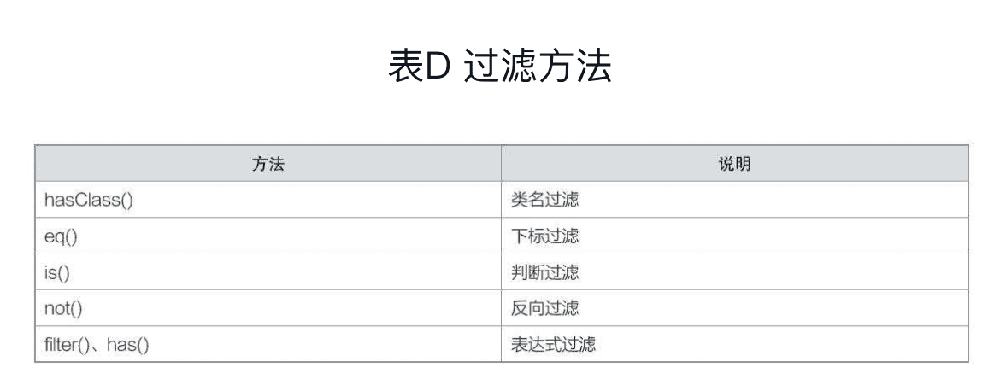

《从0到1：jQuery快速上手》笔记
----------


## 1  jQuery简介

### “JavaScript”和“JavaScript库”

“jQuery、Prototype、Mootools、YUI、Dojo、Ext.js……”

把“JavaScript”看成是“原料”，则“JavaScript库”可以看成是用原料做成的“半成品”，而程序用到的功能或特效就是“成品”。

三大框架（Vue、React、Angular）

jQuery API文档：http://api.jquery.com。

jQuery UI文档：http://jqueryui.com/demos。

jQuery Mobile文档：http://jquerymobile.com/demos。

jQuery插件：https://plugins.jquery.com。

### jQuery下载与安装

jQuery文件有两个常用版本：一个是1.x版本，另一个是3.x版本。

3.x版本是目前的最新版本，与1.x版本有着相同的API。1.x版本兼容IE6、IE7和IE8，而3.x版本不兼容IE6、IE7和IE8。在实际开发中，我们建议使用1.x版本，而不是3.x版本，原因有两个：

- 现在很多网站还是要考虑兼容IE6~IE8。
- 大多数jQuery插件不支持3.x版本，只支持1.x版本。

所谓的安装jQuery，其实就是把jQuery文件作为外部JavaScript文件引入后，就可以使用jQuery语法了。

## 2 基础选择器

选择器，就是用一种方式把想要的那一个元素选中。

在JavaScript中，如果想要选取元素，只能使用getElementById()、getElementsByTagName()、getElementsByClassName()等方法来获取。

jQuery选择器完全继承了CSS选择器的风格，极大地方便了我们的开发。

jQuery选择器有两类：一类是“基础选择器”，另一类是“伪类选择器”。

基础选择器有以下3种：基本选择器、层次选择器、属性选择器。

### 基本选择器

```javascript
$("选择器")
```

#### 元素选择器

```javascript
$("元素名")

$(function() {
  $("div").css("color", "red");
})
```

```javascript
$(function() {
  ...
})
// 类似
window.onload=function() {
  ...
}
```

把CSS选择器的写法套入`$("")`中，就变成jQuery选择器了。


#### id选择器

```javascript
$("#id名")
```

#### class选择器

```javascript
$(".类名")
```

#### 群组选择器

```javascript
$("选择器1, 选择器2, ..., 选择器n")
```


### 层次选择器

层次选择器，就是通过元素之间的层次关系来选择元素的一种基础选择器。常见的层次关系包括：父子、后代、兄弟、相邻。


- `$("M N")`可以使用`$(M).find(N)`代替。
- `$("M>N")`可以使用`$(M).children(N)`代替。
- `$("M~N")`可以使用`$(M).nextAll(N)`代替。
- `$("M+N")`可以使用`$(M).next(N)`代替。

### 属性选择器

属性选择器，指的是通过“元素的属性”来选择元素的一种基础选择器。

常见jQuery的属性选择器（其中E指的是元素，attr指的是属性，value指的是属性值）：


```javascript
// 选取含有class属性的div元素
$("div[class]")

// 选取type取值为checkbox的input元素
$("input[type = 'checkbox']")

// 选取type取值不是checkbox的input元素。
$("input[type != 'checkbox']")

// 选取class属性包含nav的div元素（class属性可以包含多个值）
$("div[class *= 'nav']")

// 选取class属性以nav开头的div元素，例如<div class="nav-header"></div>
$("div[class ^= 'nav']")

// 选取class属性以nav结尾的div元素，例如<div class="first-nav"></div>
$("div[class $= 'nav']")

// 选取带有id属性并且class属性是以nav开头的div元素，例如<div id="container"class="nav-header"></div>
$("div[id][class ^= 'nav']")
```


## 3 伪类选择器

jQuery伪类选择器，可以看成是一种特殊的选择器。参考CSS伪类选择器的形式，jQuery都是以英文冒号`:`开头的。常见共有6种。

### “位置”伪类选择器


```javascript
$("li:first, li:last").css("color", "red");

$("li:ood").css("color", "red");

$("li:eq(3)").css("color", "red");

$("li:lt(3)").css("color", "red");
```

lt表示less than，gt表示greater than。

### “子元素”伪类选择器

两大类

#### :first-child、:last-child、:nth-child(n)、:only-child


```javascript
$("ul li:first-child").css("background-color", "red"); 
$("ul li:nth-child(2)").css("background-color", "orange");
$("ul li:nth-child(3)").css("background-color", "yellow");
$("ul li:nth-child(4)").css("background-color", "green");
$("ul li:last-child").css("background-color", "blue"); 
```

在实际开发中，“子元素”伪类选择器特别适合操作列表的不同样式，比如隔行换色。

#### :first-of-type、:last-of-type、:nth-of-type(n)、:only-of-type


??

### “可见性”伪类选择器


```javascript
// 选取所有不可见的li元素
$("li:hidden")
```

### “内容”伪类选择器

根据元素的内部文本或者子元素来选取元素的一种伪类选择器。

 

```javascript
// 选取文本内容包含“jQuery”的p元素
$("p:contains(jQuery)").css("color", "red"); 

// 选取内部含有span的div元素
$("div:has(span)")

// 选取内部没有文本也没有子元素的td元素
$("td:empty")

// 选取内部有文本或者子元素的td元素
$("td:parent")
```

### “表单”伪类选择器

专门操作表单元素的一种伪类选择器。


### “表单属性”伪类选择器

根据表单元素的属性来选取的一种伪类选择器。


```javascript
// 选取“被选中”的单选框或复选框，实际上只有单选框和复选框才有checked这一个属性
$("input:checked").val();
```

### 其他伪类选择器


## 4 DOM基础

### 4.1 DOM简介

DOM（Document Object Model，文档对象模型），是由W3C（World Wide Web Consortium，万维网联盟）定义的一个标准。

DOM操作，可以简单理解成“元素操作”。

#### DOM结构

DOM采用的是“树形结构”，用“树节点”的形式来表示页面中的每一个元素。


每一个元素就是一个节点，而每一个节点就是一个对象。也就是说，**我们在操作元素时，其实就是把这个元素看成一个对象，然后使用这个对象的属性和方法来进行相关操作。**

在jQuery中，常见的DOM操作有7种：创建元素、插入节点、删除元素、复制元素、替换元素、包裹元素、遍历元素。

### 4.2 创建元素

在jQuery中，我们可以采用**字符串**的形式来创建一个元素节点，再通过**append()、before()**等方法把这个字符串插入到现有的元素节点中。语法：

```javascript
//方式1
var str = "字符串"; 
$().append(str); 

//方式2 
$().append("字符串") 
```

```javascript
// 凡是jQuery创建的节点字符串，习惯使用“$”开头
var $li = "<li>jQuery</li>";
$("ul").append($li);
```

### 4.3 插入节点

在JavaScript中，插入节点只有**appendChild()**和**insertBefore()**两种方法。

jQuery提供4组插入节点的方法。

#### prepend()和prependTo()

```javascript
// 表示往A内部的开始处插入B
$(A).prepend(B)
// 表示将A插入到B内部的开始处
$(A).prependTo(B)
```

等价的操作：

```javascript
//方式1
var $strong = "<strong>jQuery入门教程</strong>"; 
$("p").prepend($strong); 
//方式2 
var $strong = "<strong>jQuery入门教程</strong>"; 
$($strong).prependTo("p"); 
```

#### append()和appendTo()

```javascript
// 表示往A内部的末尾处插入B
$(A).append(B)
// 表示将A插入到B内部的末尾处
$(A).appendTo(B)
```

#### before()和insertBefore()

```javascript
// 表示往A外部的前面插入B
$(A).before(B)
// 表示将A插入到B外部的前面
$(A).insertBefore(B)
```

#### after()和insertAfter()

```javascript
// 表示往A外部的后面插入B
$(A).after(B)
// 表示将A插入到B外部的后面
$(A).insertAfter(B)
```

### 4.4 删除元素

```javascript
// 将某个元素及其内部的所有内容删除，返回值为被删除的元素，不仅会删除元素还会把元素绑定的事件删除
$().remove() 

// 类似remove()，但不会把元素绑定的事件删除
$().detach()

// 仅仅是删除后代元素，并不会删除自身元素
$().empty()
```

元素被删除后又重新被添加，如果不希望该元素保留原来绑定的事件，应该用remove()方法；如果希望该元素保留原来绑定的事件，应该使用detach()方法。

### 4.5 复制元素

```javascript
// 参数是false表示仅仅复制元素，不会复制元素所绑定的事件
$().clone(bool)
```

### 4.6 替换元素

```javascript
// 表示用B来替换A
$(A).replaceWith(B)

// 表示用A来替换B
$(A).replaceAll(B)
```

### 4.7 包裹元素

**wrap()**方法是将所有元素“单独”包裹，而**wrapAll()**方法是将所匹配的元素“一起”包裹。

```html
<p>hello</p>
<p>hello</p>
<p>hello</p>
```

`$("p").wrap("<div></div>")`的结果为：

```html
<div><p>hello</p></div>
<div><p>hello</p></div>
<div><p>hello</p></div>
```

`$("p").wrapAll("<div></div>")`的结果为：

```html
<div>
  <p>hello</p>
	<p>hello</p>
	<p>hello</p>
</div>
```

**wrapInner()**方法将所选元素的“内部所有元素以及文本”用其他元素包裹起来。

`$("p").wrapInner("<strong></strong>")`的结果为：

```html
<p><strong>hello</strong></p>
<p><strong>hello</strong></p>
<p><strong>hello</strong></p>
```

### 4.8 遍历元素

```javascript
$().each(function(index, element){
  ...
}) 
```

## 5 DOM进阶

### 5.1 属性操作

属性操作，指的是使用jQuery来操作一个元素的HTML属性（不是CSS属性）。

#### 获取属性

```javascript
$().attr("属性名")
```

#### 设置属性

```javascript
//设置一个属性
$().attr("属性", "取值") 
//设置多个属性 
$().attr({"属性1": "取值1", "属性2":"取值2", …, "属性n":"取值n"}) 
```

#### 删除属性

```javascript
$().removeAttr("属性名") 
```

#### prop()方法

prop()方法和attr()方法相似。

jQuery官方建议：具有true和false这两种取值的属性，如checked、selected和disabled等，建议使用prop()方法来操作，而其他的属性都建议使用attr()方法来操作。

### 5.2 样式操作

样式操作，指的是使用jQuery来操作一个元素的CSS属性。共有3种。

#### CSS属性操作

```javascript
// 获取属性
$().css("属性名")

// 设置属性
//设置一个属性
$().css("属性", "取值") 
//设置多个属性 
$().css({"属性1":"取值1", "属性2":"取值2", ..., "属性n":"取值n"}) 
```

#### CSS类名操作

```javascript
// 添加class
$().addClass("类名")
// 删除class
$().removeClass("类名")
//切换class
$().toggleClass("类名")
```

#### 个别样式操作??

##### 元素的宽高


##### 元素的位置


##### 滚动条的距离


### 5.3 内容操作

内容操作，指的是使用jQuery来操作一个元素的文本内容、值内容等。共有3中方法。

#### html()


#### text()


#### val()


## 6 事件基础

在jQuery中，一个事件由3部分组成：

- 事件主角：是按钮呢？还是div元素呢？还是其他？
- 事件类型：是点击呢？还是移动呢？还是其他？
- 事件过程：这个事件都发生了些什么？

jQuery基本的事件共有6种：页面事件、鼠标事件、键盘事件、表单事件、编辑事件、滚动事件。

### 页面事件


### 鼠标事件


### 键盘事件

键盘按下：keydown。

键盘松开：keyup。

### 表单事件

#### focus和blur

#### select

#### change

### 编辑事件

contextmenu

### 滚动事件

scroll()

## 7 事件进阶

### 7.1 绑定事件

jQuery的on()方法，有点类似于JavaScript的addEventListener()方法。

> 忽略：bind()、live()和delegate()方法，unbind()、die()和undelegate()方法。

### 7.2 解绑事件

jQuery的off()方法，有点类似于JavaScript的removeEventListener()方法。

### 7.3 合成事件

hover()

### 7.4 一次事件

one()

### 7.5 自定义事件

自定义事件，指的是用户自己定义的事件。在jQuery中，我们可以使用on()方法来自定义一个事件，然后使用trigger()方法来触发自定义事件。

### 7.6 event对象


### 7.7 this

原生JavaScript中的this是非常复杂的。不过在jQuery中，this的使用相对来说简单一点，大多数是用于事件操作中，**this始终指向触发当前事件的元素**。

## 8 jQuery动画

### 显示与隐藏

show()和hide()

toggle()

### 淡入与淡出

fadeIn()和fadeOut()

fadeToggle()

fadeTo()

### 滑上与滑下

slideUp()和slideDown()

slideToggle()

### 自定义动画

简单动画

累积动画

回调函数

### 队列动画

### 停止动画

### 延迟动画

### 判断动画状态


## 9 过滤方法

为了更加方便和快速地操作元素，除了选择器之外，jQuery还为我们提供了以“方法（类似于函数方法）”形式存在的两种方式：**过滤方法和查找方法**。

过滤方法和查找方法与之前学习的选择器之间是互补的关系，它们补充了很多使用选择器无法进行的操作，例如选取当前元素的父元素、获取当前元素的子元素、判断当前元素是否处于动画状态等。

### 类名过滤：hasClass()


### 下标过滤：eq()


### 判断过滤：is()


### 反向过滤：not()


### 表达式过滤：filter()、has()


## 10 查找方法

查找祖先元素

查找后代元素

查找兄弟元素

### 查找祖先元素

parent()

parents()

parentsUntil()

### 查找后代元素

children()

find()

contents()

### 向前查找兄弟元素

prev()

prevAll()

prevUntil()

### 向后查找兄弟元素

next()

nextAll()

nextUntil()

### 查找所有兄弟元素

siblings()

## 11 工具函数

工具函数，指的是在jQuery对象上定义的函数，属于全局性函数。简单来说，工具函数就是jQuery内置的一些函数，我们在实际开发中可以直接使用。

```javascript
$.函数名()
// 等价于
jQuery.函数名()
```

http://api.jquery.com/category/utilities

有5大类工具函数。

### 字符串操作

$.trim()

### URL操作

$.param()

### 数组操作


### 对象操作

$.each()

### 检测操作


### 自定义工具函数

$.extend()

```javascript
(function($){
    $.extend({ 
        "函数名": function(参数){ 
            …… 
        } 
    }); 
})(jQuery); 
```

## 12 开发插件

一个jQuery插件，你可以把它理解成是使用jQuery来封装的一个功能或特效。

一般来说，每一个jQuery插件都是放到独立的一个文件中的。我们常说的引入一个jQuery插件，其实就是引入一个外部JavaScript文件。

```html
<script src="jquery-1.12.4.min.js"></script>
<script src="jquery.[插件名].min.js"></script> 
```

### jQuery常用插件

#### 文本溢出：dotdotdot.js

#### 延迟加载：lazyload.js

#### 复制粘贴：zclip.js

#### 表单验证：validate.js

### jQuery插件分类

方法类插件

函数类插件

选择器插件


## 13 Ajax操作


Ajax，全称“Asynchronous JavaScript and XML”，即“异步的JavaScript和XML”。其核心是通过JavaScript的XMLHttpRequest对象，以一种异步的方式，向服务器发送数据请求，并且通过该对象接收请求返回的数据，从而实现客户端与服务器端的数据操作。

### load()方法


### $.get()方法


### $.post()方法


### $.getJSON()方法


### $.getScript()方法


### $.ajax()方法


## 14 高级技巧

### index()方法


### 链式调用


### jQuery对象与DOM对象


### 解决库冲突

jQuery.noConflict()


#### jQuery CDN

```html
//jQuery官网
<script 
  src="http://code.jquery.com/jquery-1.12.4.min.js" 
  integrity="sha256-ZosEbRLbNQzLpnKIkEdrPv7lOy9C27hHQ+Xp8a4MxAQ=" 
  crossorigin="anonymous"> 
</script> 

//bootCDN 
<script src="https://cdn.bootcss.com/jquery/1.12.4/jquery.min.js"></script> 
```


## 附录

### DOM操作方法


### 常见的事件


### 常见的动画


### 过滤方法



### 查找方法


