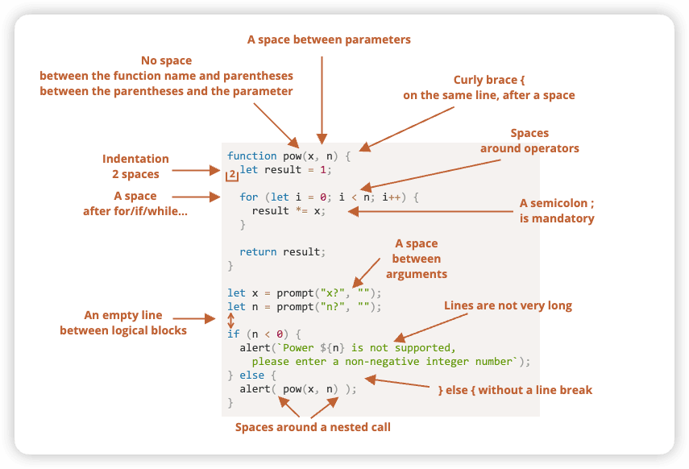

现代JavaScript教程
-------

[现代 JavaScript 教程](https://zh.javascript.info/)

# 一、JavaScript编程语言


## 1 简介

### 1.1 JavaScript简介

不同的JavaScript引擎有不同的“代号”：

- V8 —— Chrome、Opera 和 Edge 
- SpiderMonkey —— Firefox 
- 还有其他一些代号，像 “Chakra” 用于 IE，“JavaScriptCore”、“Nitro” 和 “SquirrelFish” 用于 Safari，等等。

> 引擎很复杂，但是基本原理很简单。
>
> 1. 引擎（如果是浏览器，则引擎被嵌入在其中）读取（“解析”）脚本。
> 2. 然后，引擎将脚本转化（“编译”）为机器语言。
> 3. 然后，机器代码快速地执行。

#### 浏览器中的JS能做什么？

现代的js是一种“安全的”编程语言。它不提供对内存或 CPU 的底层访问，因为它最初是为浏览器创建的，不需要这些功能。

JavaScript 的能力很大程度上**取决于它运行的环境**。例如，Node.js 支持允许 JavaScript 读取/写入任意文件，执行网络请求等的函数。

浏览器中的 JavaScript 可以做下面这些事：

- 在网页中添加新的 HTML，修改网页已有内容和网页的样式。
- 响应用户的行为，响应鼠标的点击，指针的移动，按键的按动。
- 向远程服务器发送网络请求，下载和上传文件（所谓的 AJAX 和 COMET 技术）。
- 获取或设置 cookie，向访问者提出问题或发送消息。
- 记住客户端的数据（“本地存储”）。

#### 浏览器中的JS不能做什么？

- 网页中的 JavaScript 不能读、写、复制和执行硬盘上的任意文件。它没有直接访问操作系统的功能。
- 不同的标签页/窗口之间通常互不了解。有时候，也会有一些联系。
- JavaScript 可以轻松地通过互联网与当前页面所在的服务器进行通信。但是从其他网站/域的服务器中接收数据的能力被削弱了。尽管可以，但是需要来自远程服务器的明确协议（在 HTTP header 中）。这也是为了用户的信息安全。

如果在浏览器环境外（例如在服务器上）使用 JavaScript，则不存在此类限制。现代浏览器还允许安装可能会要求扩展权限的插件/扩展。

#### 是什么使得 JavaScript 与众不同？

- 与 HTML/CSS 完全集成。
- 简单的事，简单地完成。
- 被所有的主流浏览器支持，并且默认开启。

JavaScript 是将这三件事结合在一起的唯一的浏览器技术。

#### JavaScript “上层”语言

不同的人想要不同的功能。JavaScript 的语法也不能满足所有人的需求。

最近出现了许多新语言，这些语言在浏览器中执行之前，都会被 **编译**（转化）成 JavaScript。

- [CoffeeScript](https://coffeescript.org/) 是 JavaScript 的一种语法糖。它引入了更加简短的语法，使我们可以编写更清晰简洁的代码。通常，Ruby 开发者喜欢它。
- [TypeScript](https://www.typescriptlang.org/) 专注于添加“严格的数据类型”以简化开发，以更好地支持复杂系统的开发。由微软开发。
- [Flow](https://flow.org/) 也添加了数据类型，但是以一种不同的方式。由 Facebook 开发。
- [Dart](https://www.dartlang.org/) 是一门独立的语言。它拥有自己的引擎，该引擎可以在非浏览器环境中运行（例如手机应用），它也可以被编译成 JavaScript。由 Google 开发。
- [Brython](https://brython.info/) 是一个 Python 到 JavaScript 的转译器，让我们可以在不使用 JavaScript 的情况下，以纯 Python 编写应用程序。
- [Kotlin](https://kotlinlang.org/docs/reference/js-overview.html) 是一个现代、简洁且安全的编程语言，编写出的应用程序可以在浏览器和 Node 环境中运行。

### 1.2 手册与规范

### 1.3 代码编辑器

## 2 JavaScript基础知识


### 现代模式，"use strict"


### 数据类型

- 七种原始数据类型：
  - `number` 用于任何类型的数字：整数或浮点数，在 `±(253-1)` 范围内的整数。
  - `bigint` 用于任意长度的整数。
  - `string` 用于字符串：一个字符串可以包含 0 个或多个字符，所以没有单独的单字符类型。
  - `boolean` 用于 `true` 和 `false`。
  - `null` 用于未知的值 —— 只有一个 `null` 值的独立类型。
  - `undefined` 用于未定义的值 —— 只有一个 `undefined` 值的独立类型。
  - `symbol` 用于唯一的标识符。
- 以及一种非原始数据类型：
  - `object` 用于更复杂的数据结构。


### 交互：alert、prompt 和 confirm


### 类型转换

大多数情况下，运算符和函数会自动将赋予它们的值转换为正确的类型。


### 基础运算符，数学运算


### 值的比较

### 条件分支：if 和 '?'

### 逻辑运算符


### 空值合并运算符 '??'

### 循环：while 和 for

### "switch" 语句

### 函数

### 函数表达式

**函数声明**：

```javascript
function sayHi() {
  alert( "Hello" );
}
```

另一种创建函数的语法称为 **函数表达式**。它允许我们在任何表达式的中间创建一个新函数。

例如：

```javascript
let sayHi = function() {
  alert( "Hello" );
};
```


#### 回调函数

#### 函数表达式 vs 函数声明


### 箭头函数，基础知识

创建函数另外一种非常简单的语法：

```javascript
let func = (arg1, arg2, ..., argN) => expression;
```


## 3 代码质量

### 3.1 在浏览器中调试

🔖

### 3.2 代码风格



### 3.3 注释


### 3.4 忍者代码


### 3.5 使用 Mocha 进行自动化测试🔖


### 3.6 Polyfill 和转译器

1. 转译器（Transpilers）。
2. 垫片（Polyfills


## 4 Object（对象）：基础知识


### 可选链 "?."


### symbol 类型

只有两种原始类型可以用作对象属性键：

- 字符串类型
- symbol 类型


## 5 数据类型

### JSON


## 6 函数进阶内容


### 全局对象


### 调度：setTimeout 和 setInterval


### 装饰器模式和转发，call/apply


### 函数绑定


### 深入理解箭头函数


## 7 对象属性配置

### 属性标志和属性描述符


### 属性的 getter 和 setter


## 8 原型，继承


## 9 类


### Mixin 模式


## 10 错误处理


## 11 Promise，async/await🔖


XMLHttpRequest

XMLHttpRequest对象是当今所有**AJAX和Web 2.0**应用程序的技术基础


## 12 Generator，高级 iteration


## 13 模块

### 模块 (Module) 简🔖


## 14 杂项

### Proxy 和 Reflect


### Eval：执行代码字符串


### 柯里化（Currying）


### Reference Type


### BigInt


### Unicode —— 字符串内幕


# 二、浏览器：文档、事件、接口

## 1 Document


## 2 事件简介


## 3 UI 事件


## 4 表单，控件


## 5 加载文档和其他资源

### 页面生命周期：DOMContentLoaded，load，beforeunload，unload


### 脚本：async，defer


### 资源加载：onload，onerror


## 6 杂项


### 事件循环：微任务和宏任务


# 三、其他

## 1 Frame和window

### 弹窗和 window 的方法


### 跨窗口通信🔖


### 点击劫持攻击


## 2 二进制数据，文件


## 3 网络请求

### 3.1 Fetch


### WebSocket

### XMLHttpRequest


## 4 在浏览器中存储数据
